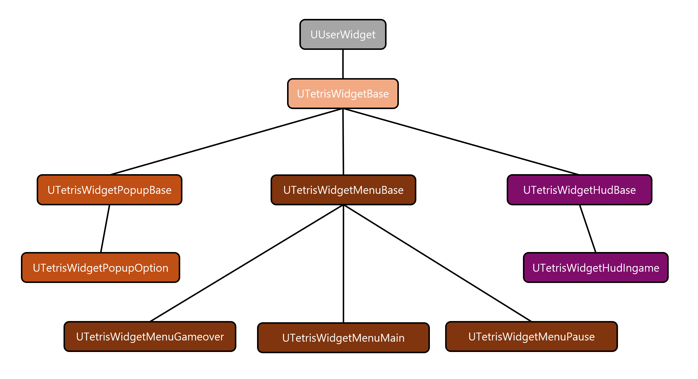
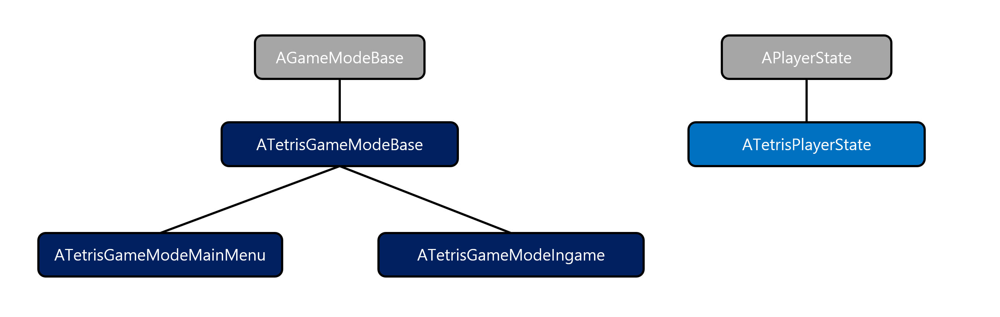

# Tetris

## Index

- [개요](#개요)
- [시현 영상](#시현-영상)
- [요구 사항 분석](#요구-사항-분석)
  - [1. 도입](#1-도입)
  - [2. 기본 게임 흐름](#2-기본-게임-흐름)
  - [3. 테트로미노 생성](#3-테트로미노-생성)
  - [4. 컨트롤](#4-컨트롤)
  - [5. 테트로미노 조작](#5-테트로미노-조작)
  - [6. 레벨 및 목표](#6-레벨-및-목표)
- [설계](#설계)
  - [프로그램 흐름](#프로그램-흐름)
  - [클래스 디자인](#클래스-디자인)
- [구현](#구현)
  - [UI](#ui)
  - [핵심 클래스](#핵심-클래스)
    - [UMino](#umino)
	- [ATetriminoBase](#atetriminobase)
	- [ABoard](#aboard)
	- [ATetrisPlayManager](#atetrisplaymanager)
	- [ATetrisPlayerControllerIngame](#atetrisplayercontrolleringame)
  - [오디오](#오디오)

---

## 개요

언리얼 엔진으로 테트리스를 만드는 프로젝트

- 개발 기간: 2024.05.28 ~ (진행 중)
- 개발 환경:
  - 1인 개발
  - OS: Windows 11
  - Engine: Unreal Engine 5.1.1
  - IDE: Visual Studio 2022
  - AI coding assistant: GitHub Copilot
  - Source Control: Git, GitHub

### 프로젝트 진행 방식

[2009 Tetris Design Guideline](./Documents/2009_Tetris_Design_Guideline.pdf)을 준수하되,  
처음부터 모든 걸 설계한 후에 구현하지 않고 하나씩 기능을 추가하면서 점진적으로 개발.

개인 프로젝트이지만 단위 기능 구현마다 [Pull Request](https://github.com/keunbum/Tetris/pulls?q=is%3Apr+is%3Aclosed)를 통해 진행 상황을 정리하고 간단한 코드 리뷰 진행.

### Best Practice

- [TETRIS 99](https://namu.wiki/w/TETRIS%2099)
- [Tetris Effect](https://namu.wiki/w/Tetris%20Effect)

### Coding Standard
[Unreal Engine Coding Standard](https://dev.epicgames.com/documentation/en-us/unreal-engine/epic-cplusplus-coding-standard-for-unreal-engine) 준수.

---

## 시현 영상

### [유튜브 영상 링크](https://youtu.be/vPVN5wCyGY4)

---

## 요구 사항 분석

[2009 Tetris Design Guideline](./Documents/2009_Tetris_Design_Guideline.pdf)의 일부를 수정 및 요약하였다.

### 1. 도입
#### 1.1. 기본 용어

**Lock Down**  
플레이 중인(매트릭스에 나와 있는) 테트로미노가 잠겨 플레이어가 이를 더 이상 조작할 수 없는 지점.  
일반적으로 테트로미노가 지면(매트릭스의 바닥이나 기존 블록)에 착지하고 나서 0.5초 후에 발생한다.  

**Matrix**  
활성 게임 영역을 만드는 직사각형 셀 배열로, 일반적으로 너비 10열 x 20행이다.  

**Mino**  
테트로미노를 이루는 단일 정사각형 모양의 구성 요소.  

**Skyline**  
매트릭스 상단의 수평선. 테트로미노는 스카이 라인 바로 위에서 떨어지기 시작한다.

**Tetromino(테트로미노)**  
측면을 따라 연결된 4개의 미노들로 구성된 기하학적 Tetris® 모양.  
각각 고유한 색상으로 표시되는 4개의 미노들을 사용하여 총 7개의 테트로미노를 만들 수 있다.  


### 2. 기본 게임 흐름

#### 2.1 인터페이스


**1. The Matrix**  
게임 플레이가 발생하는 영역이다. 표준 매트릭스 치수는 높이 20셀 x 너비 10셀이다.

**2. Tetromino in Play**  
매트릭스에 들어와 있는 테트로미노.  
플레이어는 이 테트로미노를 오른쪽 또는 왼쪽으로 이동하고, 시계 방향 또는 반시계 방향으로 회전하고, 하드 또는 소프트 드롭으로 조작할 수 있다.  
하드 드롭을 하면 테트로미노가 즉시 똑바로 떨어져서 착지한 첫 번째 표면에 고정된다(잠긴다).  
소프트 드롭은 버튼을 놓을 때까지 현재 낙하 속도보다 20배 빠르게 테트로미노를 떨어뜨린다.

**3. Next Queue**  
넥스트 큐를 통해 플레이어는 생성되어 플레이에 투입될 다음 테트로미노를 볼 수 있다.

**4. Ghost Piece**  
**Tetromino in Play**의 복사본이며 플레이어에게 플레이 테트로미노가 현재 위치에서 "떨어지면" 멈출 위치를 알려준다. 고스트 피스는 테트로미노 윤곽선 또는 테트로미노의 반투명한 "유령" 이미지로 나타날 수 있다.

**5. Game Information**  
플레이 중인 게임과 관련된 정보가 화면에 표시된다.

- 경과시간
- 현재 레벨
- 지워진 줄 수 / 지워야 할 남은 줄 수

**6. Hold Queue**  
홀드 큐를 통해 플레이어는 떨어지는 테트리미노를 고정(홀드)할 수 있다.
홀드 큐에 이미 있는 테트리미노가 있는 경우 꺼내온다.

### 3. 테트로미노 생성

#### 3.1 무작위 생성

Tetris는 일명 **bag** 시스템([7-bag system](https://namu.wiki/w/%ED%85%8C%ED%8A%B8%EB%A6%AC%EC%8A%A4/%EC%9A%A9%EC%96%B4#s-5.3))을 사용하여 게임 플레이 중에 나타나는 테트로미노의 순서를 결정한다.  
이 시스템은 7개의 테트로미노 간 균등한 분배를 허용한다.

7개의 서로 다른 테트로미노를 가상의 가방(bag)에 넣은 후 무작위 순서로 섞는다. 이 순서는 곧 bag이 Next Queue에  
공급하는 순서를 의미한다. 새로운 테트로미노가 생성되어 매트릭스 내에서 떨어지기 시작할 때마다 가방의 라인 맨  
앞에 있는 테트로미노는 Next Queue의 끝에 배치되어 모든 테트로미노를 하나씩 앞으로 밀어낸다.  
가방이 비워지면 다시 채워지고 섞인다.


### 4. 컨트롤

|          Control Function         |           Joystick          |   Keyboard  |
|:---------------------------------:|:---------------------------:|:-----------:|
|        Move Tetromino LEFT        |     Directional Pad LEFT    |  LEFT Arrow |
|        Move Tetromino RIGHT       |    Directional Pad RIGHT    | Right Arrow |
|             Hard Drop             |      Directional Pad UP     |  Space Bar  |
|             Soft Drop             |     Directional Pad DOWN    |  DOWN Arrow |
|    Rotate Tetromino Clockwise     |     Outer (Right) Button    | UP Arrow, X |
| Rotate Tetromino Counterclockwise |     Inner (Left) Button     |      Z      |
|                Hold               | Button3 /  Shoulder Buttons |      C      |
|             Pause Game            |        Start / Select       |    Esc      |


### 5. 테트로미노 조작

### 5.1 이동(Movement)

테트로미노(Tetromino in play)는 한 번에 한 셀씩 스카이라인 바로 위에서 떨어지고 한 번에 한 셀씩 왼쪽과 오른쪽으로 이동한다. 오른쪽, 왼쪽 및 아래쪽 이동만 허용된다.

### 5.2 자동 반복(Auto-Repeat)

이동 버튼을 탭하면 누른 방향으로 테트로미노의 단일 셀 이동을 할 수 있다. 이동 버튼을 누르고 있으면
플레이어가 테트로미노를 매트릭스의 한 쪽에서 다른 쪽으로 약 0.5초 안에 이동할 수 있는 **자동 반복** 동작이 트리거된다. 

이동 버튼을 누르는 시간과 자동 반복이 시작되는 시간 사이에 약 0.3초 정도의 지연(**자동 반복 지연 시간**)이 있어야 한다. 
이러한 **자동 반복 지연**은 테트로미노의 원치 않는 추가 움직임을 방지한다. 자동 반복은 왼쪽/오른쪽 이동에만 영향을 미친다.
자동 반복은 이동 버튼을 누르고 있는 동안 다음 테트로미노가 나오기 전(현재 테트로미노 잠금 후)까지 계속된다.

또한 자동 반복이 시작되고 플레이어가 반대 방향 버튼을 누르고 있으면 테트로미노는 초기 지연과 함께 
반대 방향으로 이동을 시작해야 한다. 이것은 주로 둘 이상의 방향 버튼을 동시에 누를 수 있는 키보드나 휴대폰과 같은 이동 버튼이 있는 장치에 적용된다.
그런 다음 버튼 하나를 놓으면 테트로미노는 약 0.3초의 자동 반복 지연이 한 번 더 적용된 상태에서 여전히 잡고 있는 방향으로 다시 이동해야 한다.

### 5.3 회전(Rotation)

테트로미노는 **슈퍼 회전 시스템**(Super Rotation System)을 사용하여 시계 방향 및 시계 반대 방향으로 회전할 수 있다. 이 시스템은 벽에 대고 회전하는 것과 같이 원래의 클래식 회전 시스템이 허용하지 않는 상황에서 테트로미노 회전을 허용한다.

회전 버튼을 누를 때마다 플레이 테트로미노가 시계 방향 또는 반시계 방향으로 90도 회전한다. 테트로미노가 왼쪽 또는 오른쪽으로 자동 반복되는 동안 회전을 수행할 수 있다. 회전 자체에 자동 반복은 없다.

### 5.4 하드 드롭(Hard Drop)

하드 드롭 명령은 테트로미노를 즉시 떨어뜨리고 바로 아래 표면에 고정시킨다. 하드 드롭된 테트로미노가 현재 위치에서 잠기기까지 떨어지는 데 걸리는 시간은 0.0001초이다. 하드 드롭에는 자동 반복이 없다.

### 5.5 소프트 드롭(Soft Drop)

소프트 드롭 명령을 누르면 플레이 중인 테트로미노가 일반 낙하 속도보다 20배 빠른 속도(라인당 초 단위로 측정됨. 즉, 한 줄 이동하는데 몇 초 걸리는지)로 떨어진다. 소프트 드롭 버튼에서 손을 떼면 테트로미노가 정상 낙하 속도를 재개한다. 예를 들어 정상적인 낙하 속도가 라인당 0.5초이면 소프트 드롭 속도는 라인당 (0.5 / 20) = 0.025초이다.

플레이어가 테트로미노를 표면에 떨어질 때까지 소프트 드롭하면 잠금 타이머가 0이 되기 전에는 잠금이 발생하지 않는다. 

아래로 이동을 계속하려면 소프트 드롭 버튼을 길게 누른다. 소프트 드롭은 버튼을 누르고 있는 동안 다음 테트로미노가 나올 때까지 계속된다.

### 5.6 홀드(Hold)

Hold 명령을 사용하면 플레이 중인 테트로미노가 Hold Queue에 배치된다. 이전에 가지고 있던 테트로미노는 생성 위치(스카이 라인 바로 위)와 북쪽을 향하는 방향에서 시작하여 매트릭스 상단에서 떨어지기 시작한다. 하나의 테트로미노만 홀드할 수 있다.

잠금은 반드시 보류와 보류 사이에 발생해야 한다. 예를 들어 처음에는 첫 번째 테트로미노가 생성되고 떨어지기 시작한다. 플레이어는 이 테트로미노를 홀드하기로 결정한다. 그러면 즉시 Next Queue에서 다음 테트로미노가 생성되고 떨어지기 시작한다. 플레이어는 다른 테트로미노를 홀드하고 싶다면 먼저 이 테트로미노(플레이 테트로미노)를 잠가야 한다. 즉, 동일한 테트로미노를 두 번 이상 홀드 할 수 없다.

---

## 설계

### 프로그램 흐름


### 클래스 디자인

- #### UserWidget


- #### Actor and ActorComponent and HUD


- #### GameMode and PlayerState


- #### PlayerController


- #### UObject and UInterface


- ### Etc


---

## 구현

로직은 대부분 블루프린트 대신 C++로 작성하였다.
(분량이 많아 일부 클래스만 샘플 코드 첨부)

### UI

UUserWidget을 상속 받은 C++ 클래스 작성 후, 이를 상속 받은 위젯 블루프린트 구현.  

#### UTetrisWidgetMenuBase  
모든 메뉴 위젯의 기본이 되는 클래스.  
메뉴 버튼 이동 시 양끝단 버튼에서도 반대쪽 끝단 버튼으로 이동하는 기능을 구현하기 위해 버튼을 담는 배열(MenuButtons)을 도입하였다.

##### TetrisWidgetMenuBase.h
```cpp
// Copyright Ryu KeunBeom. All Rights Reserved.

#pragma once

#include "CoreMinimal.h"
#include "TetrisWidgetBase.h"
#include "TetrisWidgetMenuBase.generated.h"

class UMenuButton;

UENUM()
enum class EMenuMoveDirection : uint8
{
	None = 0,
	Up = 1,
	Down = 2,
	Left = 3,
	Right = 4,
};

/**
 *
 */
UCLASS(Abstract)
class TETRIS_API UTetrisWidgetMenuBase : public UTetrisWidgetBase
{
	GENERATED_BODY()

public:
	/** static methods */
	static bool GetMenuMoveDirection(const FKey& Key, EMenuMoveDirection& OutMenuMoveDirection);
	static bool IsMenuMoveDirectionValid(const EMenuMoveDirection MenuMoveDirection) { return MenuMoveDirection != EMenuMoveDirection::None; }
	static int32 GetMenuMoveDelta(const EMenuMoveDirection MenuMoveDirection) { return ((static_cast<int32>(MenuMoveDirection) & 1) == 1) ? -1 : 1; }
	static FName GetMenuMoveDirectionName(const EMenuMoveDirection MenuMoveDirection);

protected:
	/** UUserWidget Interface */
	virtual void NativeOnInitialized() override;
	virtual void NativeConstruct() override;
	virtual FReply NativeOnPreviewKeyDown(const FGeometry& InGeometry, const FKeyEvent& InKeyEvent) override;
	/** ~UUserWidget Interface */

	void SetDefaultMenuButtonFocus();
	void SetWidgetFocusOnly();

	bool IsNoButtonFocused() const { return FocusedButtonIndex == UTetrisWidgetMenuBase::InvalidButtonIndex; }

	void SetMenuButtonFocusByButtonIndex(const int32 NewFocusedButtonIndex);
	void MoveMenuButtonFocus(const int32 MoveDelta);

private:
	void SetInitialFocus();

	/** static methods */
	static bool IsUpKey(const FKey& Key) { return (Key == EKeys::Up || Key == EKeys::Gamepad_DPad_Up || Key == EKeys::Gamepad_LeftStick_Up); }
	static bool IsDownKey(const FKey& Key) { return (Key == EKeys::Down || Key == EKeys::Gamepad_DPad_Down || Key == EKeys::Gamepad_LeftStick_Down); }
	static bool IsLeftKey(const FKey& Key) { return (Key == EKeys::Left || Key == EKeys::Gamepad_DPad_Left || Key == EKeys::Gamepad_LeftStick_Left); }
	static bool IsRightKey(const FKey& Key) { return (Key == EKeys::Right || Key == EKeys::Gamepad_DPad_Right || Key == EKeys::Gamepad_LeftStick_Right); }

protected:
	static constexpr int32 InvalidButtonIndex = -1;
	static constexpr int32 DefaultFocusedButtonIndex = 0;

	UPROPERTY()
	TArray<TObjectPtr<UMenuButton>> MenuButtons;

	UPROPERTY(VisibleAnywhere)
	int32 FocusedButtonIndex = 0;
};

```

##### TetrisWidgetMenuBase.cpp
```cpp
// Copyright Ryu KeunBeom. All Rights Reserved.

#include "TetrisWidgetMenuBase.h"

#include "MenuButton.h"

bool UTetrisWidgetMenuBase::GetMenuMoveDirection(const FKey& Key, EMenuMoveDirection& OutMenuMoveDirection)
{
	static const TArray<TPair<TFunction<bool(const FKey&)>, EMenuMoveDirection>> FuncAndDirectionPairs =
	{
		{ IsUpKey, EMenuMoveDirection::Up },
		{ IsDownKey, EMenuMoveDirection::Down },
		{ IsLeftKey, EMenuMoveDirection::Left },
		{ IsRightKey, EMenuMoveDirection::Right }
	};

	for (const auto& [Func, Direction] : FuncAndDirectionPairs)
	{
		if (Func(Key))
		{
			OutMenuMoveDirection = Direction;
			return true;
		}
	}

	return false;
}

FName UTetrisWidgetMenuBase::GetMenuMoveDirectionName(const EMenuMoveDirection MenuMoveDirection)
{
	switch (MenuMoveDirection)
	{
	case EMenuMoveDirection::Up:
		return TEXT("Up");
	case EMenuMoveDirection::Down:
		return TEXT("Down");
	case EMenuMoveDirection::Left:
		return TEXT("Left");
	case EMenuMoveDirection::Right:
		return TEXT("Right");
	default:
		checkNoEntry();
		return NAME_None;
	}
}

void UTetrisWidgetMenuBase::NativeOnInitialized()
{
	Super::NativeOnInitialized();

	bIsFocusable = true;
}

void UTetrisWidgetMenuBase::NativeConstruct()
{
	Super::NativeConstruct();

	SetInitialFocus();
}

FReply UTetrisWidgetMenuBase::NativeOnPreviewKeyDown(const FGeometry& InGeometry, const FKeyEvent& InKeyEvent)
{
	// 포커싱된 버튼이 없다면 첫 번째(디폴트) 버튼에 포커싱.
	if (IsNoButtonFocused())
	{
		SetDefaultMenuButtonFocus();
		return FReply::Handled();
	}

	// 버튼에 포커싱된 적 있지만, 다른 위젯에 포커싱 되었다가 돌아와 버튼 포커싱이 풀린 경우, 다시 맞춤.
	if (UMenuButton* const MenuButton = MenuButtons[FocusedButtonIndex];
		MenuButton && !MenuButton->HasKeyboardFocus())
	{
		MenuButton->SetKeyboardFocus();
		return FReply::Handled();
	}

	// 버튼 포커싱 되어 있다면 사용자 입력에 따라 버튼 이동.
	const FKey Key = InKeyEvent.GetKey();
	if (EMenuMoveDirection MenuMoveDirection = EMenuMoveDirection::None;
		UTetrisWidgetMenuBase::GetMenuMoveDirection(Key, MenuMoveDirection))
	{
		const int32 MoveDelta = UTetrisWidgetMenuBase::GetMenuMoveDelta(MenuMoveDirection);
		MoveMenuButtonFocus(MoveDelta);
		return FReply::Handled();
	}

	return Super::NativeOnPreviewKeyDown(InGeometry, InKeyEvent);
}

void UTetrisWidgetMenuBase::SetDefaultMenuButtonFocus()
{
	SetMenuButtonFocusByButtonIndex(DefaultFocusedButtonIndex);
}

void UTetrisWidgetMenuBase::SetWidgetFocusOnly()
{
	// 초기에 포커싱된 버튼 없음.
	FocusedButtonIndex = UTetrisWidgetMenuBase::InvalidButtonIndex;
	// 위젯 자체에는 포커싱이 걸려야 키보드 입력을 받을 수 있음.
	SetFocus();
}

void UTetrisWidgetMenuBase::SetMenuButtonFocusByButtonIndex(const int32 NewFocusedButtonIndex)
{
	if (UMenuButton* const MenuButton = MenuButtons[NewFocusedButtonIndex])
	{
		FocusedButtonIndex = NewFocusedButtonIndex;
		MenuButton->SetFocus();
	}
}

void UTetrisWidgetMenuBase::MoveMenuButtonFocus(const int32 MoveDelta)
{
	// 끝단 버튼에서 이동하면 반대쪽 끝단 버튼으로 이동.
	// (0번 버튼에서 위로 이동하면 (N-1)번 버튼으로, (N-1)번 버튼에서 아래로 이동하면 0번 버튼으로)
	// 연결 리스트로 구현할 수도 있지만 편의상 배열로 구현.
	const int32 NewFocusedButtonIndex = (FocusedButtonIndex + MoveDelta + MenuButtons.Num()) % MenuButtons.Num();
	SetMenuButtonFocusByButtonIndex(NewFocusedButtonIndex);
}

void UTetrisWidgetMenuBase::SetInitialFocus()
{
	SetWidgetFocusOnly();
}

```

#### UTetrisWidgetMenuMain
메인 메뉴용 위젯 블루프린트인 [WB_MenuMain](./Content/UI/WB_MenuMain.uasset)가 상속 받는 클래스.  

##### TetrisWidgetMenuMain.h
```cpp
// Copyright Ryu KeunBeom. All Rights Reserved.

#pragma once

#include "CoreMinimal.h"
#include "TetrisWidgetMenuBase.h"
#include "TetrisWidgetMenuMain.generated.h"

class UTetrisWidgetPopupOption;

/**
 * 
 */
UCLASS()
class TETRIS_API UTetrisWidgetMenuMain : public UTetrisWidgetMenuBase
{
	GENERATED_BODY()

protected:
	/** UUserWidget Interface */
	virtual void NativeOnInitialized() override;
	/** ~UUserWidget Interface */

private:
	UFUNCTION()
	void OnStartClicked();

	UFUNCTION()
	void OnOptionClicked();

	UFUNCTION()
	void OnExitClicked();

private:
	UPROPERTY(meta = (BindWidget))
	TObjectPtr<UMenuButton> StartButton;

	UPROPERTY(meta = (BindWidget))
	TObjectPtr<UMenuButton> OptionButton;

	UPROPERTY(meta = (BindWidget))
	TObjectPtr<UMenuButton> ExitButton;

	/** Widget References */
	UPROPERTY()
	TObjectPtr<UTetrisWidgetPopupOption> WidgetPopupOption;

	/** Widget Class References */
	UPROPERTY(EditDefaultsOnly, Category = "Classes")
	TSubclassOf<UTetrisWidgetPopupOption> WidgetPopupOptionClass;
};

```

##### TetrisWidgetMenuMain.cpp
```cpp
// Copyright Ryu KeunBeom. All Rights Reserved.

#include "TetrisWidgetMenuMain.h"

#include "Kismet/GameplayStatics.h"

#include "TetrisGameModeIngame.h"
#include "TetrisWidgetPopupOption.h"
#include "MenuButton.h"

void UTetrisWidgetMenuMain::NativeOnInitialized()
{
	Super::NativeOnInitialized();

	if (StartButton)
	{
		MenuButtons.Add(StartButton);
		StartButton->OnClicked.AddDynamic(this, &UTetrisWidgetMenuMain::OnStartClicked);
	}
	if (OptionButton)
	{
		MenuButtons.Add(OptionButton);
		OptionButton->OnClicked.AddDynamic(this, &UTetrisWidgetMenuMain::OnOptionClicked);
	}
	if (ExitButton)
	{
		MenuButtons.Add(ExitButton);
		ExitButton->OnClicked.AddDynamic(this, &UTetrisWidgetMenuMain::OnExitClicked);
	}

	WidgetPopupOption = CreateWidget<UTetrisWidgetPopupOption>(GetWorld(), WidgetPopupOptionClass);
}

void UTetrisWidgetMenuMain::OnStartClicked()
{
	// Open Tetris Level
	UGameplayStatics::OpenLevel(GetWorld(), ATetrisGameModeIngame::TetrisLevelName);
}

void UTetrisWidgetMenuMain::OnOptionClicked()
{
	if (WidgetPopupOption)
	{
		WidgetPopupOption->AddToViewport();
	}
}

void UTetrisWidgetMenuMain::OnExitClicked()
{
	// Exit Game
	UKismetSystemLibrary::QuitGame(GetWorld(), nullptr, EQuitPreference::Quit, false);
}

```

#### WB_MenuMain


### 핵심 클래스

#### UMino
테트로미노에서 각 단위 블록을 모델링 한 클래스.  
Mino 객체 생성 시 필요한 정보를 FMinoInfo를 구조체를 선언하여 주고 받았다.

##### UMino.h
```cpp
// Copyright Ryu KeunBeom. All Rights Reserved.

#pragma once

#include "CoreMinimal.h"
#include "Components/StaticMeshComponent.h"

#include "Mino.generated.h"

class UMaterialInterface;

/**
 * @struct FMinoInfo
 * @brief Mino 객체 생성용 정보 구조체
 */
struct FMinoInfo
{
	FString MaterialPath;
	FLinearColor BaseColor;
	float Opacity;
	int32 TranslucentSortPriority;

	FMinoInfo()
		: FMinoInfo(TEXT(""), FLinearColor::White, 1.0f, 0)
	{
	}

	FMinoInfo(const FString& InMaterialPath, const FLinearColor& InBaseColor, const float InOpacity, const int32 InTranslucentSortPriority)
		: MaterialPath(InMaterialPath)
		, BaseColor(InBaseColor)
		, Opacity(InOpacity)
		, TranslucentSortPriority(InTranslucentSortPriority)
	{
	}
};

/**
 * @class UMino
 * @brief 테트리미노의 각 블록을 나타내는 StaticMeshComponent 클래스
 */
UCLASS()
class TETRIS_API UMino : public UStaticMeshComponent
{
	GENERATED_BODY()

public:
	UMino();

	void SetRelativeLocationByMatrixLocation(const FIntPoint& MatrixLocation, const float Z = 0.0f);
	void AttachToWithMatrixLocation(USceneComponent* const Parent, const FIntPoint& MatrixLocation, const float Z = 0.0f);

	static UMino* NewMino(UObject* const InOuter, const FMinoInfo& MinoInfo);
	static FVector GetRelativeLocationByMatrixLocation(const FIntPoint& MatrixLocation, const float Z = 0.0f);
	static UMaterialInterface* GetMaterialByMinoInfo(const FMinoInfo& MinoInfo);
	static UMaterialInstanceDynamic* GetMaterialInstanceByMinoInfo(UObject* const InOuter, const FMinoInfo& MinoInfo);

private:
	static constexpr float DefaultUnitLength = 100.f;

public:
	static constexpr float MinoScale = 1.0f;
	static constexpr float UnitLength = DefaultUnitLength * MinoScale;
	static const FString DefaultMaterialPath;

private:
	static const FName BaseColorParameterName;
	static const FName OpacityParameterName;
	static const FString CubeMeshPath;
};
```

##### UMino.cpp

```cpp
// Copyright Ryu KeunBeom. All Rights Reserved.

#include "Mino.h"

#include "UObject/ConstructorHelpers.h"

const FName UMino::BaseColorParameterName = TEXT("BaseColor");
const FName UMino::OpacityParameterName = TEXT("Opacity");
const FString UMino::CubeMeshPath = TEXT("/Engine/BasicShapes/Cube.Cube");
const FString UMino::MaterialOutlinePath = TEXT("/Game/Material/M_MinoOutline");


UMino::UMino()
{
	static const ConstructorHelpers::FObjectFinder<UStaticMesh> CubeMesh(*UMino::CubeMeshPath);
	if (CubeMesh.Succeeded())
	{
		UStaticMeshComponent::SetStaticMesh(CubeMesh.Object);
	}

	SetWorldScale3D(FVector(UMino::MinoScale));
}

void UMino::SetRelativeLocationByMatrixLocation(const FIntPoint& MatrixLocation, const float Z)
{
	SetRelativeLocation(UMino::GetRelativeLocationByMatrixLocation(MatrixLocation, Z));
}

void UMino::AttachToWithMatrixLocation(USceneComponent* const Parent, const FIntPoint& MatrixLocation, const float Z)
{
	AttachToComponent(Parent, FAttachmentTransformRules::KeepRelativeTransform);
	SetRelativeLocationByMatrixLocation(MatrixLocation, Z);
}

UMino* UMino::NewMino(UObject* const InOuter, const FMinoInfo& MinoInfo)
{
	if (UMino* const Mino = NewObject<UMino>(InOuter))
	{
		if (UMaterialInstanceDynamic* const MaterialInstance = UMino::GetMaterialInstanceByMinoInfo(InOuter, MinoInfo))
		{
			static constexpr int32 ElementIndex = 0;
			Mino->SetMaterial(ElementIndex, MaterialInstance);
			Mino->SetTranslucentSortPriority(MinoInfo.TranslucentSortPriority);
			Mino->RegisterComponent();
			return Mino;
		}
	}
	return nullptr;
}

FVector UMino::GetRelativeLocationByMatrixLocation(const FIntPoint& MatrixLocation, const float Z)
{
	// 1. 크기 고려하여 실제 위치 계산
	// 2. 행렬 기반 좌표를 XYZ 좌표계로 변환
	const float X = -UnitLength * MatrixLocation.Y;
	const float Y = -UnitLength * MatrixLocation.X;
	return FVector(X, Y, Z);
}

UMaterialInterface* UMino::GetMaterialByMinoInfo(const FMinoInfo& MinoInfo)
{
	UMaterialInterface* const MinoMaterial = Cast<UMaterialInterface>(StaticLoadObject(UMaterialInterface::StaticClass(), nullptr, *MinoInfo.MaterialPath));
	ensureMsgf(MinoMaterial != nullptr, TEXT("Failed to load material: %s"), *MinoInfo.MaterialPath);
	return MinoMaterial;
}

UMaterialInstanceDynamic* UMino::GetMaterialInstanceByMinoInfo(UObject* const InOuter, const FMinoInfo& MinoInfo)
{
	if (UMaterialInterface* const BaseMaterial = UMino::GetMaterialByMinoInfo(MinoInfo))
	{
		if (UMaterialInstanceDynamic* const DynamicMaterialInstance = UMaterialInstanceDynamic::Create(BaseMaterial, InOuter))
		{
			DynamicMaterialInstance->SetVectorParameterValue(UMino::BaseColorParameterName, MinoInfo.BaseColor);
			DynamicMaterialInstance->SetScalarParameterValue(UMino::OpacityParameterName, MinoInfo.Opacity);
			return DynamicMaterialInstance;
		}
	}
	return nullptr;
}

```

각 미노는 메시로 큐브를 이용했는데 경계면(정육면체의 각 모서리)을 눈에 띄게 하기 위해 머티리얼 그래프를 활용하였다.  
(구현하기 위해 참고한 영상: https://youtu.be/KHiZfy5OlO8?si=k5IqeGzICTXFvT9D)

##### M_MinoOutline (Material)


##### CalculateEmphasizedBorderColor (Material Function)


##### CalculateBorderEmphasisFactor (Material Function)


#### ATetriminoBase
테트로미노(테트리미노)를 모델링한 추상 클래스.  
조작 중인 테트리미노 클래스와 그림자 역할을 하는 고스트피스 클래스의 구현이 일부 다르므로 공통의 추상 클래스가 필요했다.

##### ATetriminoBase.h

```cpp
// Copyright Ryu KeunBeom. All Rights Reserved.

#pragma once

#include "CoreMinimal.h"
#include "Containers/Map.h"
#include "Containers/UnrealString.h"
#include "GameFramework/Actor.h"
#include "Math/MathFwd.h"

#include "EnumClassOperators.h"
#include "Mino.h"

#include "TetriminoBase.generated.h"

class ABoard;

UENUM()
enum class ETetriminoShape : int8
{
	None = -1,
	O,
	I,
	T,
	L,
	J,
	S,
	Z,
	Max
};

UENUM()
enum class ETetriminoFacing : int8
{
	None = -1,
	North,
	East,
	South,
	West,
	Max
};

ENUM_CLASS_OPERATORS(ETetriminoFacing)

UENUM()
enum class ETetriminoRotationDirection : int8
{
	CounterClockwise = -1,
	Clockwise = 1
};

struct FTetriminoShapeInfo
{
	TMap<ETetriminoFacing, TArray<FIntPoint>> MinoTetriminoLocalLocationsByFacing;
	FLinearColor BaseColor;
	FIntPoint InitialMatrixLocation;
	TMap<ETetriminoFacing, TMap<ETetriminoRotationDirection, TArray<FIntPoint>>> SRSRotationPointOffsetsTable; // Super Rotation System Rotation Point Table
};

/**
 * @class ATetriminoBase
 */
UCLASS(Abstract)
class TETRIS_API ATetriminoBase : public AActor
{
	GENERATED_BODY()

public:
	ATetriminoBase();

	virtual const FMinoInfo GetMinoInfo() const PURE_VIRTUAL(ATetriminoBase::GetMinoInfo, return FMinoInfo(););

	const FTetriminoShapeInfo& GetTetriminoShapeInfo() const;
	const FIntPoint& GetInitialMatrixLocation() const;
	const TArray<FIntPoint>& GetMinoTetriminoLocalLocations() const;
	const TArray<FIntPoint>& GetSRSRotationPointOffsets(const ETetriminoRotationDirection RotationDirection) const;

	const ETetriminoShape& GetShape() const { return Shape; }
	const ETetriminoFacing& GetFacing() const { return Facing; }
	const FIntPoint& GetMatrixLocation() const { return MatrixLocation; }
	const TArray<UMino*>& GetMinoArray() const { return MinoArray; }

	void SetShape(const ETetriminoShape NewShape) { Shape = NewShape; }
	void SetFacing(const ETetriminoFacing NewFacing) { Facing = NewFacing; }
	void SetRelativeLocationByMatrixLocation(const FIntPoint& NewMatrixLocation);

	struct FInitializeParams
	{
		ETetriminoShape Shape;
		ETetriminoFacing Facing;

		FInitializeParams() = delete;

		FInitializeParams(const ETetriminoShape InShape, const ETetriminoFacing InFacing)
			: Shape(InShape)
			, Facing(InFacing)
		{
		}
	};
	void Initialize(const FInitializeParams& Params);
	void UpdateMinoTetriminoLocalLocations();
	void DetachMinos();
	void RotateByFacing(const ETetriminoFacing NewFacing);

	void DebugPrintState() const;

	// static method
	static ETetriminoShape GetTetriminoShapeRandom();
	static const TArray<FIntPoint>& GetMinoTetriminoLocalLocationsByTetriminoShapeAndFacing(const ETetriminoShape Shape, const ETetriminoFacing Facing);
	static FIntPoint GetMatrixMovementIntPointByDirection(const FVector2D& Direction);

protected:
	void SetMatrixLocation(const FIntPoint& NewMatrixLocation) { MatrixLocation = NewMatrixLocation; }

	void InitializeMinoArray();
	void DestroyMinos();
	void AddRelativeLocationByMatrixLocationOffset(const FIntPoint& MatrixLocationOffset);

	void AttachToComponentByMatrixLocation(USceneComponent* const NewParentComponent, const FIntPoint& InitialMatrixLocation);

	// static method
	static const FTetriminoShapeInfo& GetTetriminoShapeInfoByShape(const ETetriminoShape Shape);
	static const FIntPoint& GetInitialMatrixLocationByShape(const ETetriminoShape Shape);

	struct FRotationInfo
	{
		ETetriminoShape Shape;
		ETetriminoFacing Facing;
		ETetriminoRotationDirection Direction;
	};
	static const TArray<FIntPoint>& GetSRSRotationPointOffsetsByRotationInfo(const FRotationInfo& RotationInfo);
	static FString GetTetriminoShapeName(const ETetriminoShape Shape);
	static FString GetFacingName(const ETetriminoFacing Facing);

public:
	static constexpr int32 MinoNum = 4;
	static const FVector2D MoveDirectionLeft;
	static const FVector2D MoveDirectionRight;
	static const FVector2D MoveDirectionDown;

	static const TMap<ETetriminoShape, FTetriminoShapeInfo> TetriminoShapeInfos;

protected:
	UPROPERTY(VisibleAnywhere)
	ETetriminoShape Shape;

	UPROPERTY(VisibleAnywhere)
	ETetriminoFacing Facing;

	UPROPERTY(VisibleAnywhere)
	FIntPoint MatrixLocation;

	UPROPERTY(VisibleAnywhere)
	TSubclassOf<UMino> MinoClass;

	UPROPERTY(VisibleAnywhere)
	TArray<TObjectPtr<UMino>> MinoArray;
};

```

##### ATetriminoBase.cpp

```cpp
// Copyright Ryu KeunBeom. All Rights Reserved.

#include "TetriminoBase.h"

#include "Mino.h"
#include "Board.h"

// (행, 열) 기반으로 방향을 나타냄. (0행 0열이 기준)
const FVector2D ATetriminoBase::MoveDirectionLeft = FVector2D(0, -1);
const FVector2D ATetriminoBase::MoveDirectionRight = -MoveDirectionLeft;
const FVector2D ATetriminoBase::MoveDirectionDown = MoveDirectionLeft.GetRotated(90.f);

/* 
 * 테트리미노 모양별 정보
 * 모두 (행, 열) 기반으로 표현됨.
 * 예를 들어 T의 North가 {1, 1}, {2, 0}, {2, 1}, {2, 2}와 같이 표현되는 건 각각 1행 1열, 2행 0열, 2행 1열, 2행 2열에 해당하는 미노들이라는 뜻.
 * 그림으로 나타내면 아래와 같다.
 * x x x x
 * x o x x
 * o o o x
 * x x x x
 */
const TMap<ETetriminoShape, FTetriminoShapeInfo> ATetriminoBase::TetriminoShapeInfos =
{
	{
		ETetriminoShape::O,
		{
			{
				{ ETetriminoFacing::North, { {1, 1}, {1, 2}, {2, 1}, {2, 2} } },
				{ ETetriminoFacing::East, { {1, 1}, {1, 2}, {2, 1}, {2, 2} } },
				{ ETetriminoFacing::South, { {1, 1}, {1, 2}, {2, 1}, {2, 2} } },
				{ ETetriminoFacing::West, { {1, 1}, {1, 2}, {2, 1}, {2, 2} } }
			},
			FLinearColor::Yellow,
			FIntPoint(ABoard::TetriminoDefaultSpawnLocationX - 3, ABoard::TetriminoDefaultSpawnLocationY),
			{
				{
					ETetriminoFacing::North,
					{
						{ ETetriminoRotationDirection::CounterClockwise, { {0, 0} } },
						{ ETetriminoRotationDirection::Clockwise, { {0, 0} } },
					}
				},
				{
					ETetriminoFacing::East,
					{
						{ ETetriminoRotationDirection::CounterClockwise, { {0, 0} } },
						{ ETetriminoRotationDirection::Clockwise, { {0, 0} } },
					}
				},
				{
					ETetriminoFacing::South,
					{
						{ ETetriminoRotationDirection::CounterClockwise, { {0, 0} } },
						{ ETetriminoRotationDirection::Clockwise, { {0, 0} } },
					}
				},
				{
					ETetriminoFacing::West,
					{
						{ ETetriminoRotationDirection::CounterClockwise, { {0, 0} } },
						{ ETetriminoRotationDirection::Clockwise, { {0, 0} } },
					}
				}
			},
		}
	},
	{
		ETetriminoShape::I,
		{
			{
				{ ETetriminoFacing::North, { {1, 0}, {1, 1}, {1, 2}, {1, 3} } },
				{ ETetriminoFacing::East, { {0, 2}, {1, 2}, {2, 2}, {3, 2} } },
				{ ETetriminoFacing::South, { {2, 0}, {2, 1}, {2, 2}, {2, 3} } },
				{ ETetriminoFacing::West, { {0, 1}, {1, 1}, {2, 1}, {3, 1} } }
			},
			FLinearColor(0.0f, 1.0f, 1.0f),
			FIntPoint(ABoard::TetriminoDefaultSpawnLocationX - 2, ABoard::TetriminoDefaultSpawnLocationY),
			{
				{
					ETetriminoFacing::North,
					{
						{ ETetriminoRotationDirection::CounterClockwise, { {0, 0}, {0, -1}, {0, 2}, {-2, -1}, {1, 2} } },
						{ ETetriminoRotationDirection::Clockwise, { {0, 0}, {0, -2}, {0, 1}, {1, -2}, {-2, 1} } },
					}
				},
				{
					ETetriminoFacing::East,
					{
						{ ETetriminoRotationDirection::CounterClockwise, { {0, 0}, {0, 2}, {0, -1}, {-1, 2}, {-2, -1} } },
						{ ETetriminoRotationDirection::Clockwise, { {0, 0}, {0, -1}, {0, 2}, {-2, -1}, {1, 2} } },
					}
				},
				{
					ETetriminoFacing::South,
					{
						{ ETetriminoRotationDirection::CounterClockwise, { {0, 0}, {0, 1}, {0, -2}, {2, 1}, {-1, -2} } },
						{ ETetriminoRotationDirection::Clockwise, { {0, 0}, {0, 2}, {0, -1}, {-1, 2}, {2, -1} } },
					}
				},
				{
					ETetriminoFacing::West,
					{
						{ ETetriminoRotationDirection::CounterClockwise, { {0, 0}, {0, -2}, {0, 1}, {1, -2}, {-2, 1} } },
						{ ETetriminoRotationDirection::Clockwise, { {0, 0}, {0, 1}, {0, -2}, {2, 1}, {-1, -2} } },
					}
				}
			},
		}
	},
	{
		ETetriminoShape::T,
		{
			{
				{ ETetriminoFacing::North, { {1, 1}, {2, 0}, {2, 1}, {2, 2} } },
				{ ETetriminoFacing::East, { {1, 1}, {2, 1}, {2, 2}, {3, 1} } },
				{ ETetriminoFacing::South, { {2, 0}, {2, 1}, {2, 2}, {3, 1} } },
				{ ETetriminoFacing::West, { {1, 1}, {2, 0}, {2, 1}, {3, 1} } }
			},
			FLinearColor(0.5f, 0.0f, 0.5f),
			FIntPoint(ABoard::TetriminoDefaultSpawnLocationX - 3, ABoard::TetriminoDefaultSpawnLocationY),
			{
				{
					ETetriminoFacing::North,
					{
						{ ETetriminoRotationDirection::CounterClockwise, { {0, 0}, {0, 1}, {-1, 1}, {2, 1} } },
						{ ETetriminoRotationDirection::Clockwise, { {0, 0}, {0, -1}, {-1, -1}, {2, -1} } }
					}
				},
				{
					ETetriminoFacing::East,
					{
						{ ETetriminoRotationDirection::CounterClockwise, { {0, 0}, {0, 1}, {1, 1}, {-2, 0}, {-2, 1} } },
						{ ETetriminoRotationDirection::Clockwise, { {0, 0}, {0, 1}, {1, 1}, {-2, 0}, {-2, 1} } },
					}
				},
				{
					ETetriminoFacing::South,
					{
						{ ETetriminoRotationDirection::CounterClockwise, { {0, 0}, {0, -1}, {2, 0}, {2, -1} } },
						{ ETetriminoRotationDirection::Clockwise, { {0, 0}, {0, 1}, {2, 0}, {2, 1} } },
					}
				},
				{
					ETetriminoFacing::West,
					{
						{ ETetriminoRotationDirection::CounterClockwise, { {0, 0}, {0, -1}, {1, -1}, {-2, 0}, {-2, -1} } },
						{ ETetriminoRotationDirection::Clockwise, { {0, 0}, {0, -1}, {1, -1}, {-2, 0}, {-2, -1} } },
					}
				}
			},
		}
	},
	{
		ETetriminoShape::L,
		{
			{
				{ ETetriminoFacing::North, { {1, 2}, {2, 0}, {2, 1}, {2, 2} } },
				{ ETetriminoFacing::East, { {1, 1}, {2, 1}, {3, 1}, {3, 2} } },
				{ ETetriminoFacing::South, { {2, 0}, {2, 1}, {2, 2}, {3, 0} } },
				{ ETetriminoFacing::West, { {1, 0}, {1, 1}, {2, 1}, {3, 1} } }
			},
			FLinearColor(1.0f, 0.5f, 0.0f),
			FIntPoint(ABoard::TetriminoDefaultSpawnLocationX - 3, ABoard::TetriminoDefaultSpawnLocationY),
			{
				{
					ETetriminoFacing::North,
					{
						{ ETetriminoRotationDirection::CounterClockwise, { {0, 0}, {0, 1}, {-1, 1}, {2, 0}, {2, 1} } },
						{ ETetriminoRotationDirection::Clockwise, { {0, 0}, {0, -1}, {-1, -1}, {2, 0}, {2, -1} } },
					}
				},
				{
					ETetriminoFacing::East,
					{
						{ ETetriminoRotationDirection::CounterClockwise, { {0, 0}, {0, 1}, {1, 1}, {-2, 0}, {-2, 1} } },
						{ ETetriminoRotationDirection::Clockwise, { {0, 0}, {0, 1}, {1, 1}, {-2, 0}, {-2, 1} } },
					}
				},
				{
					ETetriminoFacing::South,
					{
						{ ETetriminoRotationDirection::CounterClockwise, { {0, 0}, {0, -1}, {-1, -1}, {2, 0}, {2, -1} } },
						{ ETetriminoRotationDirection::Clockwise, { {0, 0}, {0, 1}, {-1, 1}, {2, 0}, {2, 1} } },
					}
				},
				{
					ETetriminoFacing::West,
					{
						{ ETetriminoRotationDirection::CounterClockwise, { {0, 0}, {0, -1}, {1, -1}, {-2, 0}, {-2, -1} } },
						{ ETetriminoRotationDirection::Clockwise, { {0, 0}, {0, -1}, {1, -1}, {-2, 0}, {-2, -1} } },
					}
				}
			},
		}
	},
	{
		ETetriminoShape::J,
		{
			{
				{ ETetriminoFacing::North, { {1, 0}, {2, 0}, {2, 1}, {2, 2} } },
				{ ETetriminoFacing::East, { {1, 1}, {1, 2}, {2, 1}, {3, 1} } },
				{ ETetriminoFacing::South, { {2, 0}, {2, 1}, {2, 2}, {3, 2} } },
				{ ETetriminoFacing::West, { {1, 1}, {2, 1}, {3, 0}, {3, 1} } }
			},
			FLinearColor::Blue,
			FIntPoint(ABoard::TetriminoDefaultSpawnLocationX - 3, ABoard::TetriminoDefaultSpawnLocationY),
			{
				{
					ETetriminoFacing::North,
					{
						{ ETetriminoRotationDirection::CounterClockwise, { {0, 0}, {0, 1}, {-1, 1}, {2, 0}, {2, 1} } },
						{ ETetriminoRotationDirection::Clockwise, { {0, 0}, {0, -1}, {-1, -1}, {2, 0}, {2, -1} } },
					}
				},
				{
					ETetriminoFacing::East,
					{
						{ ETetriminoRotationDirection::CounterClockwise, { {0, 0}, {0, 1}, {1, 1}, {-2, 0}, {-2, 1} } },
						{ ETetriminoRotationDirection::Clockwise, { {0, 0}, {0, 1}, {1, 1}, {-2, 0}, {-2, 1} } },
					}
				},
				{
					ETetriminoFacing::South,
					{
						{ ETetriminoRotationDirection::CounterClockwise, { {0, 0}, {0, -1}, {-1, -1}, {2, 0}, {2, -1} } },
						{ ETetriminoRotationDirection::Clockwise, { {0, 0}, {0, 1}, {-1, 1}, {2, 0}, {2, 1} } },
					}
				},
				{
					ETetriminoFacing::West,
					{
						{ ETetriminoRotationDirection::CounterClockwise, { {0, 0}, {0, -1}, {1, -1}, {-2, 0}, {-2, -1} } },
						{ ETetriminoRotationDirection::Clockwise, { {0, 0}, {0, -1}, {1, -1}, {-2, 0}, {-2, -1} } },
					}
				}
			},
		}
	},
	{
		ETetriminoShape::S,
		{
			{
				{ ETetriminoFacing::North, { {1, 1}, {1, 2}, {2, 0}, {2, 1} } },
				{ ETetriminoFacing::East, { {1, 1}, {2, 1}, {2, 2}, {3, 2} } },
				{ ETetriminoFacing::South, { {2, 1}, {2, 2}, {3, 0}, {3, 1} } },
				{ ETetriminoFacing::West, { {1, 0}, {2, 0}, {2, 1}, {3, 1} } }
			},
			FLinearColor::Green,
			FIntPoint(ABoard::TetriminoDefaultSpawnLocationX - 3, ABoard::TetriminoDefaultSpawnLocationY),
			{
				{
					ETetriminoFacing::North,
					{
						{ ETetriminoRotationDirection::CounterClockwise, { {0, 0}, {0, 1}, {-1, 1}, {2, 0}, {2, 1} } },
						{ ETetriminoRotationDirection::Clockwise, { {0, 0}, {0, -1}, {-1, -1}, {2, 0}, {2, -1} } },
					}
				},
				{
					ETetriminoFacing::East,
					{
						{ ETetriminoRotationDirection::CounterClockwise, { {0, 0}, {0, 1}, {1, 1}, {-2, 0}, {-2, 1} } },
						{ ETetriminoRotationDirection::Clockwise, { {0, 0}, {0, 1}, {1, 1}, {-2, 0}, {-2, 1} } },
					}
				},
				{
					ETetriminoFacing::South,
					{
						{ ETetriminoRotationDirection::CounterClockwise, { {0, 0}, {0, -1}, {-1, -1}, {2, 0}, {2, -1} } },
						{ ETetriminoRotationDirection::Clockwise, { {0, 0}, {0, 1}, {-1, 1}, {2, 0}, {2, 1} } },
					}
				},
				{
					ETetriminoFacing::West,
					{
						{ ETetriminoRotationDirection::CounterClockwise, { {0, 0}, {0, -1}, {1, -1}, {-2, 0}, {-2, -1} } },
						{ ETetriminoRotationDirection::Clockwise, { {0, 0}, {0, -1}, {1, -1}, {-2, 0}, {-2, -1} } },
					}
				}
			},
		}
	},
	{
		ETetriminoShape::Z,
		{
			{
				{ ETetriminoFacing::North, { {1, 0}, {1, 1}, {2, 1}, {2, 2} } },
				{ ETetriminoFacing::East, { {1, 2}, {2, 1}, {2, 2}, {3, 1} } },
				{ ETetriminoFacing::South, { {2, 0}, {2, 1}, {3, 1}, {3, 2} } },
				{ ETetriminoFacing::West, { {1, 1}, {2, 0}, {2, 1}, {3, 0} } }
			},
			FLinearColor::Red,
			FIntPoint(ABoard::TetriminoDefaultSpawnLocationX - 3, ABoard::TetriminoDefaultSpawnLocationY),
			{
				{
					ETetriminoFacing::North,
					{
						{ ETetriminoRotationDirection::CounterClockwise, { {0, 0}, {0, 1}, {-1, 1}, {2, 0}, {2, 1} } },
						{ ETetriminoRotationDirection::Clockwise, { {0, 0}, {0, -1}, {-1, -1}, {2, 0}, {2, -1} } },
					}
				},
				{
					ETetriminoFacing::East,
					{
						{ ETetriminoRotationDirection::CounterClockwise, { {0, 0}, {0, 1}, {1, 1}, {-2, 0}, {-2, 1} } },
						{ ETetriminoRotationDirection::Clockwise, { {0, 0}, {0, 1}, {1, 1}, {-2, 0}, {-2, 1} } },
					}
				},
				{
					ETetriminoFacing::South,
					{
						{ ETetriminoRotationDirection::CounterClockwise, { {0, 0}, {0, -1}, {-1, -1}, {2, 0}, {2, -1} } },
						{ ETetriminoRotationDirection::Clockwise, { {0, 0}, {0, 1}, {-1, 1}, {2, 0}, {2, 1} } },
					}
				},
				{
					ETetriminoFacing::West,
					{
						{ ETetriminoRotationDirection::CounterClockwise, { {0, 0}, {0, -1}, {1, -1}, {-2, 0}, {-2, -1} } },
						{ ETetriminoRotationDirection::Clockwise, { {0, 0}, {0, -1}, {1, -1}, {-2, 0}, {-2, -1} } },
					}
				}
			},
		}
	}
};

ATetriminoBase::ATetriminoBase()
	: Shape(ETetriminoShape::None)
	, Facing(ETetriminoFacing::None)
	, MatrixLocation(FIntPoint(0, 0))
	, MinoClass(UMino::StaticClass())
	, MinoArray()
{
	PrimaryActorTick.bCanEverTick = false;

	RootComponent = CreateDefaultSubobject<USceneComponent>(TEXT("RootComponent"));
}

const TArray<FIntPoint>& ATetriminoBase::GetMinoTetriminoLocalLocations() const
{
	return ATetriminoBase::GetMinoTetriminoLocalLocationsByTetriminoShapeAndFacing(Shape, Facing);
}

const TArray<FIntPoint>& ATetriminoBase::GetSRSRotationPointOffsets(const ETetriminoRotationDirection RotationDirection) const
{
	const FRotationInfo RotationInfo(Shape, Facing, RotationDirection);
	return ATetriminoBase::GetSRSRotationPointOffsetsByRotationInfo(RotationInfo);
}

const FTetriminoShapeInfo& ATetriminoBase::GetTetriminoShapeInfo() const
{
	return ATetriminoBase::GetTetriminoShapeInfoByShape(Shape);
}

const FIntPoint& ATetriminoBase::GetInitialMatrixLocation() const
{
	return ATetriminoBase::GetInitialMatrixLocationByShape(Shape);
}

void ATetriminoBase::SetRelativeLocationByMatrixLocation(const FIntPoint& NewMatrixLocation)
{
	const FVector ActorLocalOffset(UMino::GetRelativeLocationByMatrixLocation(NewMatrixLocation));
	SetActorRelativeLocation(ActorLocalOffset);
	SetMatrixLocation(NewMatrixLocation);
}

void ATetriminoBase::Initialize(const FInitializeParams& Params)
{
	SetShape(Params.Shape);
	SetFacing(Params.Facing);

	InitializeMinoArray();
}

void ATetriminoBase::UpdateMinoTetriminoLocalLocations()
{
	const TArray<FIntPoint>& MinoTetriminoLocalLocations = GetMinoTetriminoLocalLocations();
	for (int32 MinoIndex = 0; MinoIndex < MinoNum; ++MinoIndex)
	{
		if (UMino* const Mino = MinoArray[MinoIndex])
		{
			const FIntPoint& NewMinoTetriminoLocalLocation = MinoTetriminoLocalLocations[MinoIndex];
			Mino->SetRelativeLocationByMatrixLocation(NewMinoTetriminoLocalLocation);
		}
	}
}

void ATetriminoBase::DetachMinos()
{
	for (UMino* const Mino : MinoArray)
	{
		if (Mino)
		{
			Mino->DetachFromComponent(FDetachmentTransformRules::KeepWorldTransform);
		}
	}
}

void ATetriminoBase::RotateByFacing(const ETetriminoFacing NewFacing)
{
	SetFacing(NewFacing);
	UpdateMinoTetriminoLocalLocations();
}

void ATetriminoBase::DebugPrintState() const
{
	UE_LOG(LogTemp, Log, TEXT("TetriminoInPlay Type: %s"), *GetTetriminoShapeName(Shape));
	//UE_LOG(LogTemp, Log, TEXT("Tetrimino: Location: %s"), *GetActorLocation().ToString());
	UE_LOG(LogTemp, Log, TEXT("Tetrimino: Facing: %s"), *GetFacingName(Facing));

	//for (int32 Index = 0; Index < MinoNum; ++Index)
	//{
	//	if (MinoArray[Index])
	//	{
	//		const FVector MinoRelativeLocation = MinoArray[Index]->GetRelativeLocation();
	//		UE_LOG(LogTemp, Log, TEXT("Mino %d: Relative Location: %s"), Index, *MinoRelativeLocation.ToString());
	//	}
	//}
}

ETetriminoShape ATetriminoBase::GetTetriminoShapeRandom()
{
	const int32 RandomIndex = FMath::RandRange(0, static_cast<int32>(ETetriminoShape::Max) - 1);
	const ETetriminoShape TetriminoShape = static_cast<ETetriminoShape>(RandomIndex);
	return TetriminoShape;
}

const TArray<FIntPoint>& ATetriminoBase::GetMinoTetriminoLocalLocationsByTetriminoShapeAndFacing(const ETetriminoShape Shape, const ETetriminoFacing Facing)
{
	const FTetriminoShapeInfo& TetriminoShapeInfo = ATetriminoBase::GetTetriminoShapeInfoByShape(Shape);
	return TetriminoShapeInfo.MinoTetriminoLocalLocationsByFacing[Facing];
}

FIntPoint ATetriminoBase::GetMatrixMovementIntPointByDirection(const FVector2D& Direction)
{
	static constexpr float OneSpace = 1.0f;
	const FVector2D MovementVector2D = OneSpace * Direction;
	return FIntPoint(static_cast<int32>(MovementVector2D.X), static_cast<int32>(MovementVector2D.Y));
}

void ATetriminoBase::InitializeMinoArray()
{
	const TArray<FIntPoint>& MinoTetriminoLocalLocations = GetMinoTetriminoLocalLocations();
	const FMinoInfo MinoInfo = GetMinoInfo();

	DestroyMinos();
	MinoArray.Empty(MinoNum);

	for (const FIntPoint& MinoTetriminoLocalLocation : MinoTetriminoLocalLocations)
	{
		if (UMino* const Mino = UMino::NewMino(this, MinoInfo))
		{
			Mino->AttachToWithMatrixLocation(RootComponent, MinoTetriminoLocalLocation);
			MinoArray.Add(Mino);
		}
	}
}

void ATetriminoBase::DestroyMinos()
{
	for (UMino* const Mino : MinoArray)
	{
		if (Mino)
		{
			Mino->DetachFromComponent(FDetachmentTransformRules::KeepWorldTransform);
			Mino->DestroyComponent();
		}
	}
}

void ATetriminoBase::AddRelativeLocationByMatrixLocationOffset(const FIntPoint& MatrixLocationOffset)
{
	const FVector ActorLocalOffset(UMino::GetRelativeLocationByMatrixLocation(MatrixLocationOffset));
	AddActorLocalOffset(ActorLocalOffset);
	MatrixLocation += MatrixLocationOffset;
}

void ATetriminoBase::AttachToComponentByMatrixLocation(USceneComponent* const NewParentComponent, const FIntPoint& InitialMatrixLocation)
{
	if (RootComponent)
	{
		RootComponent->AttachToComponent(NewParentComponent, FAttachmentTransformRules::KeepRelativeTransform);
		SetRelativeLocationByMatrixLocation(InitialMatrixLocation);
	}
}

const FTetriminoShapeInfo& ATetriminoBase::GetTetriminoShapeInfoByShape(const ETetriminoShape Shape)
{
	const FTetriminoShapeInfo* TetriminoShapeInfo = TetriminoShapeInfos.Find(Shape);
	check(TetriminoShapeInfo != nullptr);
	return *TetriminoShapeInfo;
}

const FIntPoint& ATetriminoBase::GetInitialMatrixLocationByShape(const ETetriminoShape Shape)
{
	const FTetriminoShapeInfo& TetriminoShapeInfo = ATetriminoBase::GetTetriminoShapeInfoByShape(Shape);
	return TetriminoShapeInfo.InitialMatrixLocation;
}

const TArray<FIntPoint>& ATetriminoBase::GetSRSRotationPointOffsetsByRotationInfo(const FRotationInfo& RotationInfo)
{
	const FTetriminoShapeInfo& TetriminoShapeInfo = ATetriminoBase::GetTetriminoShapeInfoByShape(RotationInfo.Shape);
	return TetriminoShapeInfo.SRSRotationPointOffsetsTable[RotationInfo.Facing][RotationInfo.Direction];
}

FString ATetriminoBase::GetTetriminoShapeName(const ETetriminoShape Shape)
{
	static const TMap<ETetriminoShape, FString> TetriminoShapeNames =
	{
		{ETetriminoShape::O, TEXT("O")},
		{ETetriminoShape::I, TEXT("I")},
		{ETetriminoShape::T, TEXT("T")},
		{ETetriminoShape::L, TEXT("L")},
		{ETetriminoShape::J, TEXT("J")},
		{ETetriminoShape::S, TEXT("S")},
		{ETetriminoShape::Z, TEXT("Z")}
	};

	if (const FString* Name = TetriminoShapeNames.Find(Shape))
	{
		return *Name;
	}
	return TEXT("None");
}

FString ATetriminoBase::GetFacingName(const ETetriminoFacing Facing)
{
	static const TMap<ETetriminoFacing, FString> TetriminoFacingNames =
	{
		{ETetriminoFacing::North, TEXT("North")},
		{ETetriminoFacing::East, TEXT("East")},
		{ETetriminoFacing::South, TEXT("South")},
		{ETetriminoFacing::West, TEXT("West")},
	};

	if (const FString* Name = TetriminoFacingNames.Find(Facing))
	{
		return *Name;
	}
	return TEXT("None");
}

```

#### ABoard
플레이어가 조작하는 테트리미노가 움직이는 영역이자, 블록들이 쌓이는 판(보드)를 모델링한 클래스.  
해당 객체에 컨트롤러 카메라 뷰를 설정하였다.

##### ABoard.h
```cpp
// Copyright Ryu KeunBeom. All Rights Reserved.

#pragma once

#include "CoreMinimal.h"
#include "GameFramework/Actor.h"

#include "Mino.h"
#include "Tetrimino.h"

#include "Board.generated.h"

struct FMinoInfo;
class UMino;
class UCameraComponent;

/**
 * @class ABoard
 * @brief Represents the game board in the Tetris.
 */
UCLASS()
class TETRIS_API ABoard : public AActor
{
	GENERATED_BODY()
	
public:
	ABoard();

	/** Initializes */
	void Initialize();

	/** Check Methods */
	// Determine if the Tetrimino directly above a surface (the floor or another block)?
	bool IsDirectlyAboveSurface(const ATetrimino* Tetrimino) const;
	// Determine if the Tetrimino is blocked due to an existing Block in the Matrix.
	bool IsBlocked(const ATetrimino* Tetrimino) const;
	// Determine if the Tetrimino is above the skyline.
	bool IsAboveSkyline(const ATetrimino* Tetrimino) const;
	bool IsMovementPossible(const ATetrimino* Tetrimino, const FIntPoint& MovementIntPoint2D) const;
	bool IsRotationPossible(const ATetrimino* Tetrimino, const ETetriminoRotationDirection RotationDirection, const FIntPoint& RotationPointOffset) const;
	bool IsRowFull(const int32 TargetRow) const;

	/** Get Methods */
	USceneComponent* GetMatrixRoot() const { return MatrixRoot; }
	USceneComponent* GetNextQueueRoot() const { return NextQueueRoot; }
	USceneComponent* GetHoldQueueRoot() const { return HoldQueueRoot; }

	/** Non-const Methods */
	void AddMinos(const ATetrimino* Tetrimino);
	// HitList에 있는 Row를 제거하고, 위에 있는 Row를 아래로 내린다.
	void ClearRows(const TArray<int32>& TargetRows);

	/** Const Methods */
	// Returns the final falling location of the Tetrimino in the matrix.
	FIntPoint GetFinalFallingMatrixLocation(const ATetrimino* Tetrimino) const;

	/** Static Methods */
	static int32 GetMatrixIndexByMatrixLocation(const FIntPoint& MatrixLocation);

private:
	/** Create */
	void CreateBoardComponents();
	void CreateMatrixWalls();
	// Matrix Transform 확인을 위한 테스트용 메서드
	void CreateBackgroundMinos();

	/** Initializes */
	void InitializeMinoMatrix();

	/** Check Methods */
	bool IsMatrixLocationEmpty(const FIntPoint& MatrixLocation) const;
	bool IsMinoLocationsPossible(const TArray<FIntPoint>& MinoLocalMatrixLocations, const FIntPoint& TetriminoMatrixLocation) const;

	/** Get/Set Methods */
	UMino* GetMinoByMatrixLocation(const FIntPoint& MatrixLocation) const;
	void SetMinoByMatrixLocation(UMino* const Mino, const FIntPoint& MatrixLocation);

	/** Non-const Methods */
	template<typename TReturnType>
	TReturnType* CreateAndSetupComponent(const FName& ComponentName, USceneComponent* const Parent, const FVector& RelativeLocation)
	{
		if (TReturnType* const Component = CreateDefaultSubobject<TReturnType>(ComponentName))
		{
			Component->SetupAttachment(Parent);
			Component->SetRelativeLocation(RelativeLocation);
			return Component;
		}
		checkNoEntry();
		return nullptr;
	}
	void AddMino(UMino* const Mino, const FIntPoint& MinoMatrixLocation);
	void ClearRow(const int32 TargetRow);
	void MoveRow(const int32 TargetRow, const int32 MoveDistance);
	void RemoveMino(UMino* const Mino, const FIntPoint& MinoMatrixLocation);
	void MoveMino(UMino* const Mino, const FIntPoint& OldMatrixLocation, const FIntPoint& NewMatrixLocation);

public:
	static constexpr int32 TotalHeight = 40;
	static constexpr int32 TotalWidth = 10;
	/** [TotalBeginRow, TotalEndRow) */
	static constexpr int32 TotalBeginRow = 0;
	/** [TotalBeginRow, TotalEndRow) */
	static constexpr int32 TotalEndRow = TotalBeginRow + TotalHeight;
	/** [TotalBeginCol, TotalEndCol) */
	static constexpr int32 TotalBeginCol = 0;
	/** [TotalBeginCol, TotalEndCol) */
	static constexpr int32 TotalEndCol = TotalBeginCol + TotalWidth;

	static constexpr int32 VisibleHeight = 20;
	static constexpr int32 VisibleWidth = 10;
	/** [VisibleBeginRow, VisibleEndRow) */
	static constexpr int32 VisibleBeginRow = TotalHeight - VisibleHeight;
	/** [VisibleBeginRow, VisibleEndRow) */
	static constexpr int32 VisibleEndRow = VisibleBeginRow + VisibleHeight;
	/** [VisibleBeginCol, VisibleEndCol) */
	static constexpr int32 VisibleBeginCol = 0;
	/** [VisibleBeginCol, VisibleEndCol) */
	static constexpr int32 VisibleEndCol = VisibleBeginCol + VisibleWidth;

	static constexpr int32 SkyLine = VisibleBeginRow;

	static constexpr int32 TetriminoDefaultSpawnLocationX = ABoard::SkyLine;
	static constexpr int32 TetriminoDefaultSpawnLocationY = ABoard::VisibleBeginCol + 3;

private:
	UPROPERTY(EditDefaultsOnly, Category = "Classes");
	TSubclassOf<UMino> MinoClass;

	UPROPERTY(VisibleAnywhere, Category = "USceneComponent")
	TObjectPtr<USceneComponent> MatrixRoot;
	
	UPROPERTY(VisibleAnywhere, Category = "USceneComponent")
	TObjectPtr<USceneComponent> NextQueueRoot;

	UPROPERTY(VisibleAnywhere, Category = "USceneComponent")
	TObjectPtr<USceneComponent> HoldQueueRoot;

	UPROPERTY(VisibleAnywhere, Category = "USceneComponent")
	TObjectPtr<USceneComponent> WallRoot;

	UPROPERTY(VisibleAnywhere, Category = "USceneComponent")
	TObjectPtr<USceneComponent> BackgroundRoot;

	UPROPERTY(VisibleAnywhere, Category = "UCameraComponent")
	TObjectPtr<UCameraComponent> Camera;

	UPROPERTY(VisibleAnywhere)
	TArray<TObjectPtr<UMino>> MinoMatrix;

	UPROPERTY(EditAnywhere)
	TArray<TObjectPtr<UStaticMeshComponent>> Walls;
};

```

##### ABoard.cpp
```cpp
// Copyright Ryu KeunBeom. All Rights Reserved.


#include "Board.h"

#include "Components/StaticMeshComponent.h"
#include "Engine/World.h"
#include "Materials/MaterialInterface.h"
#include "UObject/ConstructorHelpers.h"
#include "Algo/AllOf.h"
#include "Camera/CameraComponent.h"
#include "TetriminoBase.h"
#include "GameFramework/PlayerController.h"

ABoard::ABoard()
{
	PrimaryActorTick.bCanEverTick = false;

	MinoClass = UMino::StaticClass();

	CreateBoardComponents();
}

void ABoard::Initialize()
{
	InitializeMinoMatrix();

	if (APlayerController* const PlayerController = GetWorld()->GetFirstPlayerController())
	{
		PlayerController->SetViewTarget(this);
	}
}

bool ABoard::IsDirectlyAboveSurface(const ATetrimino* Tetrimino) const
{
	static const FIntPoint MovementDown = ATetriminoBase::GetMatrixMovementIntPointByDirection(ATetrimino::MoveDirectionDown);
	return !IsMovementPossible(Tetrimino, MovementDown);
}

bool ABoard::IsBlocked(const ATetrimino* Tetrimino) const
{
	return !IsMovementPossible(Tetrimino, FIntPoint::ZeroValue);
}

bool ABoard::IsAboveSkyline(const ATetrimino* Tetrimino) const
{
	if (Tetrimino)
	{
		const FIntPoint& TetriminoMatrixLocation = Tetrimino->GetMatrixLocation();
		const TArray<FIntPoint>& MinoTetriminoLocalLocations = Tetrimino->GetMinoTetriminoLocalLocations();
		return Algo::AllOf(MinoTetriminoLocalLocations, [this, &TetriminoMatrixLocation](const FIntPoint& MinoTetriminoLocalLocation) {
			const FIntPoint MinoLocalMatrixLocation = TetriminoMatrixLocation + MinoTetriminoLocalLocation;
			return MinoLocalMatrixLocation.X < SkyLine;
			}
		);
	}

	return false;
}

bool ABoard::IsMovementPossible(const ATetrimino* Tetrimino, const FIntPoint& MovementIntPoint2D) const
{
	if (Tetrimino)
	{
		const FIntPoint NewTetriminoMatrixLocation = Tetrimino->GetMatrixLocation() + MovementIntPoint2D;
		const TArray<FIntPoint>& MinoTetriminoLocalLocations = Tetrimino->GetMinoTetriminoLocalLocations();
		return IsMinoLocationsPossible(MinoTetriminoLocalLocations, NewTetriminoMatrixLocation);
	}

	return false;
}

bool ABoard::IsRotationPossible(const ATetrimino* Tetrimino, const ETetriminoRotationDirection RotationDirection, const FIntPoint& RotationPointOffset) const
{
	if (Tetrimino)
	{
		const FIntPoint& NewTetriminoMatrixLocation = Tetrimino->GetMatrixLocation() + RotationPointOffset;
		const ETetriminoShape TetriminoShape = Tetrimino->GetShape();
		const ETetriminoFacing NewTetriminoFacing = Tetrimino->GetFacing() + static_cast<int32>(RotationDirection);
		const TArray<FIntPoint>& NewMinoLocalMatrixLocations = ATetriminoBase::GetMinoTetriminoLocalLocationsByTetriminoShapeAndFacing(TetriminoShape, NewTetriminoFacing);
		return IsMinoLocationsPossible(NewMinoLocalMatrixLocations, NewTetriminoMatrixLocation);
	}

	return false;
}

bool ABoard::IsRowFull(const int32 TargetRow) const
{
	for (int32 TargetCol = VisibleBeginCol; TargetCol < VisibleEndCol; ++TargetCol)
	{
		const FIntPoint TargetMatrixLocation(TargetRow, TargetCol);
		if (IsMatrixLocationEmpty(TargetMatrixLocation))
		{
			return false;
		}
	}
	return true;
}

void ABoard::AddMinos(const ATetrimino* Tetrimino)
{
	if (Tetrimino)
	{
		const FIntPoint TetriminoMatrixLocation = Tetrimino->GetMatrixLocation();
		const TArray<FIntPoint>& MinoTetriminoLocalLocations = Tetrimino->GetMinoTetriminoLocalLocations();
		const TArray<UMino*>& MinoArray = Tetrimino->GetMinoArray();
		for (int32 MinoIndex = 0; MinoIndex < Tetrimino->MinoNum; ++MinoIndex)
		{
			const FIntPoint& MinoTetriminoLocalLocation = MinoTetriminoLocalLocations[MinoIndex];
			const FIntPoint MinoMatrixLocation = TetriminoMatrixLocation + MinoTetriminoLocalLocation;
			UMino* const Mino = MinoArray[MinoIndex];
			AddMino(Mino, MinoMatrixLocation);
		}
	}
}

void ABoard::ClearRows(const TArray<int32>& TargetRows)
{
	// Clear Rows
	for (const int32 TargetRow : TargetRows)
	{
		ClearRow(TargetRow);
	}

	// Move Rows
	for (int32 Index = TargetRows.Num() - 1; Index >= 0; --Index)
	{
		static constexpr int32 LastEndRow = TotalBeginRow - 1;
		const int32 EmptyRow = TargetRows[Index];
		// [BeginRow, EndRow)
		const int32 BeginRow = EmptyRow - 1;
		const int32 EndRow = (Index - 1 >= 0 ? TargetRows[Index - 1] : LastEndRow);
		for (int32 Row = BeginRow; Row > EndRow; --Row)
		{
			const int32 MoveDistance = TargetRows.Num() - Index;
			MoveRow(Row, MoveDistance);
		}
	}
}

FIntPoint ABoard::GetFinalFallingMatrixLocation(const ATetrimino* Tetrimino) const
{
	if (Tetrimino)
	{
		FIntPoint FinalFallingMatrixLocation = Tetrimino->GetMatrixLocation();
		static const FIntPoint MovementDown = ATetriminoBase::GetMatrixMovementIntPointByDirection(ATetrimino::MoveDirectionDown);
		while (IsMinoLocationsPossible(Tetrimino->GetMinoTetriminoLocalLocations(), FinalFallingMatrixLocation + MovementDown))
		{
			FinalFallingMatrixLocation += MovementDown;
		}
		return FinalFallingMatrixLocation;
	}

	return FIntPoint::ZeroValue;
}

int32 ABoard::GetMatrixIndexByMatrixLocation(const FIntPoint& MatrixLocation)
{
	return TotalWidth * MatrixLocation.X + MatrixLocation.Y;
}

void ABoard::CreateBoardComponents()
{
	// 양수/음수 순서대로 FVector(좌/우, 위/아래, 앞/뒤)
	static const FVector MatrixRelativeLocation = UMino::UnitLength * FVector(0.f, 0.f, 0.f);
	static const FVector NextQueueRelativeLocation = UMino::UnitLength * FVector(-15.f, -15.f, -10.f);
	static const FVector HoldQueueRelativeLocation = UMino::UnitLength * FVector(8.f, -15.f, -10.f);
	static const FVector WallRelativeLocation = UMino::UnitLength * FVector(0.f, -(ABoard::TotalHeight - ABoard::VisibleHeight), 0.f);
	static const FVector CameraRelativeLocation = UMino::UnitLength * FVector(-VisibleWidth / 2, -30.f, 31.f);

	RootComponent = CreateDefaultSubobject<USceneComponent>(TEXT("RootComponent"));
	MatrixRoot = CreateAndSetupComponent<USceneComponent>(TEXT("MatrixRoot"), RootComponent, MatrixRelativeLocation);
	NextQueueRoot = CreateAndSetupComponent<USceneComponent>(TEXT("NextQueueRoot"), MatrixRoot, NextQueueRelativeLocation);
	HoldQueueRoot = CreateAndSetupComponent<USceneComponent>(TEXT("HoldQueueRoot"), MatrixRoot, HoldQueueRelativeLocation);
	WallRoot = CreateAndSetupComponent<USceneComponent>(TEXT("WallRoot"), MatrixRoot, WallRelativeLocation);
	BackgroundRoot = CreateAndSetupComponent<USceneComponent>(TEXT("BackgroundRoot"), MatrixRoot, FVector::ZeroVector);

	CreateMatrixWalls();

	Camera = CreateAndSetupComponent<UCameraComponent>(TEXT("Camera"), MatrixRoot, CameraRelativeLocation);
	if (Camera)
	{
		Camera->SetRelativeRotation(FRotator(-90.f, 0.f, 90.f));
	}
}

void ABoard::CreateMatrixWalls()
{
	static const TCHAR* WallMeshPath = TEXT("/Engine/BasicShapes/Cube");
	static ConstructorHelpers::FObjectFinder<UStaticMesh> WallMesh(WallMeshPath);
	if (!ensureMsgf(WallMesh.Succeeded(), TEXT("Failed to Load WallMesh")))
	{
		return;
	}

	static constexpr int32 WallNum = 4;
	Walls.Reserve(WallNum);

	if (UStaticMeshComponent* const LeftWall = CreateDefaultSubobject<UStaticMeshComponent>(TEXT("LeftWall")))
	{
		LeftWall->SetRelativeTransform(FTransform(FRotator(0.f, 0.f, 0.f), UMino::UnitLength * FVector(0.55f, -9.5f, 0.f), FVector(0.1f, 20.f, 1.f)));
		Walls.Add(LeftWall);
	}

	if (UStaticMeshComponent* const RightWall = CreateDefaultSubobject<UStaticMeshComponent>(TEXT("RightWall")))
	{
		RightWall->SetRelativeTransform(FTransform(FRotator(0.f, 0.f, 0.f), UMino::UnitLength * FVector(-9.55f, -9.50f, 0.f), FVector(0.1f, 20.f, 1.f)));
		Walls.Add(RightWall);
	}

	if (UStaticMeshComponent* const BackWall = CreateDefaultSubobject<UStaticMeshComponent>(TEXT("BackWall")))
	{
		BackWall->SetRelativeTransform(FTransform(FRotator(0.f, 0.f, 0.f), UMino::UnitLength * FVector(-4.5f, -9.5f, -0.55f), FVector(10.f, 20.f, 0.1f)));
		Walls.Add(BackWall);
	}

	if (UStaticMeshComponent* const Floor = CreateDefaultSubobject<UStaticMeshComponent>(TEXT("Floor")))
	{
		Floor->SetRelativeTransform(FTransform(FRotator(0.f, 0.f, 0.f), UMino::UnitLength * FVector(-4.5f, -19.55f, 0.f), FVector(10.2f, 0.1f, 1.f)));
		Walls.Add(Floor);
	}

	for (UStaticMeshComponent* const Wall : Walls)
	{
		Wall->SetupAttachment(WallRoot);
		Wall->SetStaticMesh(WallMesh.Object);
	}
}

void ABoard::CreateBackgroundMinos()
{
	// Matrix의 배경 역할을 하는 Mino들을 생성.
	for (int32 Row = VisibleBeginRow; Row < VisibleEndRow; ++Row)
	{
		static const FMinoInfo FirstRowMinoInfo = FMinoInfo(TEXT("/Game/Material/M_MinoMaterial_Black"), FLinearColor::Black, 1.0f, 0);
		static const FMinoInfo BackgroundBaseMinoInfo = FMinoInfo(TEXT("/Game/Material/M_MinoMaterial"), FLinearColor::White, 1.0f, 0);
		const FMinoInfo& MinoInfo = (Row == VisibleBeginRow ? FirstRowMinoInfo : BackgroundBaseMinoInfo);
		for (int32 Col = VisibleBeginCol; Col < VisibleEndCol; ++Col)
		{
			const FIntPoint MinoMatrixLocation(Row, Col);
			static constexpr float Z = 0.f;
			const FString MinoName = FString::Printf(TEXT("Mino_%d_%d"), Row, Col);
			if (UMino* const Mino = CreateDefaultSubobject<UMino>(*MinoName))
			{
				if (UMaterialInterface* const MinoMaterial = Cast<UMaterialInterface>(StaticLoadObject(UMaterialInterface::StaticClass(), nullptr, *MinoInfo.MaterialPath)))
				{
					static constexpr int32 ElementIndex = 0;
					Mino->SetMaterial(ElementIndex, MinoMaterial);
				}
				Mino->SetTranslucentSortPriority(-2);
				Mino->AttachToWithMatrixLocation(BackgroundRoot, MinoMatrixLocation, Z);
			}
		}
	}
}

void ABoard::InitializeMinoMatrix()
{
	MinoMatrix.Reserve(TotalHeight * TotalWidth);
	for (int32 _ = 0; _ < TotalHeight * TotalWidth; ++_)
	{
		UMino* const Mino = nullptr;
		MinoMatrix.Add(Mino);
	}
}

UMino* ABoard::GetMinoByMatrixLocation(const FIntPoint& MatrixLocation) const
{
	const int32 Index = ABoard::GetMatrixIndexByMatrixLocation(MatrixLocation);
	return MinoMatrix[Index];
}

void ABoard::SetMinoByMatrixLocation(UMino* const Mino, const FIntPoint& MatrixLocation)
{
	const int32 Index = ABoard::GetMatrixIndexByMatrixLocation(MatrixLocation);
	MinoMatrix[Index] = Mino;
}

bool ABoard::IsMatrixLocationEmpty(const FIntPoint& MatrixLocation) const
{
	const UMino* Mino = GetMinoByMatrixLocation(MatrixLocation);
	return !IsValid(Mino);
}

bool ABoard::IsMinoLocationsPossible(const TArray<FIntPoint>& MinoTetriminoLocalLocations, const FIntPoint& TetriminoMatrixLocation) const
{
	return Algo::AllOf(MinoTetriminoLocalLocations, [this, &TetriminoMatrixLocation](const FIntPoint& MinoTetriminoLocalLocation) {
		const FIntPoint NewMinoLocalMatrixLocation = TetriminoMatrixLocation + MinoTetriminoLocalLocation;
		return FMath::IsWithin(NewMinoLocalMatrixLocation.X, TotalBeginRow, VisibleEndRow)
			&& FMath::IsWithin(NewMinoLocalMatrixLocation.Y, VisibleBeginCol, VisibleEndCol)
			&& (IsMatrixLocationEmpty(NewMinoLocalMatrixLocation));
		}
	);
}

void ABoard::AddMino(UMino* const Mino, const FIntPoint& MinoMatrixLocation)
{
	// Change ownership of the component to the board
	if (Mino)
	{
		Mino->Rename(nullptr, this);
		Mino->AttachToWithMatrixLocation(MatrixRoot, MinoMatrixLocation);
		SetMinoByMatrixLocation(Mino, MinoMatrixLocation);
	}
}

void ABoard::ClearRow(const int32 TargetRow)
{
	for (int32 TargetCol = VisibleBeginCol; TargetCol < VisibleEndCol; ++TargetCol)
	{
		const FIntPoint MinoMatrixLocation(TargetRow, TargetCol);
		UMino* const Mino = GetMinoByMatrixLocation(MinoMatrixLocation);
		RemoveMino(Mino, MinoMatrixLocation);
	}
}

void ABoard::MoveRow(const int32 TargetRow, const int32 MoveDistance)
{
	for (int32 TargetCol = VisibleBeginCol; TargetCol < VisibleEndCol; ++TargetCol)
	{
		const FIntPoint MinoMatrixLocation(TargetRow, TargetCol);
		if (!IsMatrixLocationEmpty(MinoMatrixLocation))
		{
			UMino* const Mino = GetMinoByMatrixLocation(MinoMatrixLocation);
			const FIntPoint NewMinoMatrixLocation(/* NewRow */ TargetRow + MoveDistance, TargetCol);
			MoveMino(Mino, /* OldMatrixLocation */ MinoMatrixLocation, NewMinoMatrixLocation);
		}
	}
}

void ABoard::RemoveMino(UMino* const Mino, const FIntPoint& MinoMatrixLocation)
{
	if (Mino)
	{
		Mino->DetachFromComponent(FDetachmentTransformRules::KeepWorldTransform);
		Mino->DestroyComponent();
		SetMinoByMatrixLocation(nullptr, MinoMatrixLocation);
	}
}

void ABoard::MoveMino(UMino* const Mino, const FIntPoint& OldMatrixLocation, const FIntPoint& NewMatrixLocation)
{
	if (Mino)
	{
		Mino->SetRelativeLocationByMatrixLocation(NewMatrixLocation);
		SetMinoByMatrixLocation(Mino, NewMatrixLocation);
		SetMinoByMatrixLocation(nullptr, OldMatrixLocation);
	}
}
```

#### ATetrisPlayManager
테트리스 플레이를 총괄하는 클래스.  
`ATetrisGameModeIngame`로부터 생성되며 `ATetrisPlayerControllerIngame`로부터의 입력을 처리한다.

##### ATetrisPlayManager.h

```cpp
// Copyright Ryu KeunBeom. All Rights Reserved.

#pragma once

#include "CoreMinimal.h"
#include "GameFramework/Actor.h"

#include "TetriminoBase.h"
#include "TetrisGameModeIngame.h"
#include "Board.h"

#include "TetrisPlayManager.generated.h"

class ATetrisGameModeIngame;
class ATetrimino;
class ATetriminoGhostPiece;
class ATetriminoQueue;
class UTetriminoGenerator;
class USoundBase;

UENUM()
enum class EPhase : uint8
{
	None,
	Generation,
	Falling,
	Lock,
	Pattern,
	Iterate,
	Animate,
	Elimate,
	Completion,
};

struct FExtendedPlacement
{
	FExtendedPlacement()
		: TimerResetCount(MaxTimerResetCount)
		, LowestRow(0)
	{
	}

	void Init(const int32 CurrentRow)
	{
		LowestRow = CurrentRow;
		TimerResetCount = MaxTimerResetCount;
	}

	// The number of actions remaining before the forced lock down is reached.
	// The Actions: Left/Right Movement or Rotation
	int32 TimerResetCount;
	int32 LowestRow;

	static constexpr int32 MaxTimerResetCount = 15;
};

/**
 * @class ATetrisPlayManager
 * @brief The ATetrisPlayManager class is responsible for managing the gameplay logic of the Tetris game.
 */
UCLASS()
class TETRIS_API ATetrisPlayManager : public AActor
{
	GENERATED_BODY()
	
public:
	ATetrisPlayManager();

	void Initialize();

	/** Basic Member Variable Accessors */
	const FVector2D& GetTetriminoMovementDirection() const { return AutoRepeatMovementDirection; }
	float GetNormalFallSpeed() const { return NormalFallSpeed; }
	void SetNormalFallSpeed(const float NewNormalFallSpeed) { NormalFallSpeed = NewNormalFallSpeed; }

	/** Logic */
	void EnterPhase(const EPhase NewPhase);
	void EnterPhaseWithDelay(const EPhase NewPhase, const float Delay);

	/** Event Handlers */
	void StartAutoRepeatMovement(const FVector2D& InMovementDirection);
	void EndAutoRepeatMovement();
	void StartSoftDrop();
	void EndSoftDrop();
	void DoHardDrop();
	void DoRotation(const ETetriminoRotationDirection RotationDirection);
	void HoldTetriminoInPlay();

	/** static */
	static FName GetPhaseName(const EPhase Phase);
	static bool IsAutoRepeatMovement(const FVector2D& Direction) { return (Direction == ATetriminoBase::MoveDirectionLeft || Direction == ATetriminoBase::MoveDirectionRight); }

private:
	/**  Initialization */
	void InitializeNextQueue();
	void InitializeHoldQueue();

	/** Phase Flow */
	void RunGenerationPhase();
	void RunFallingPhase();
	void RunLockPhase();
	void RunPatternPhase();
	void RunIteratePhase();
	void RunAnimatePhase();
	void RunEliminatePhase();
	void RunCompletionPhase();

	/** Logics */
	// Move
	void MoveTetriminoTo(const FVector2D& Direction);
	void MoveTetrimino();
	void MoveTetriminoDown();
	void MoveTetriminoToInternal(const FVector2D& Direction);
	void MoveTetriminoInPlayToFinalFallingLocation();
	// LockDown
	void LockDown();
	void ForceLockDown();
	void HardDrop();
	void RunLockDownSystem(const bool bIsMovedOrRotated);
	// Rotation
	void RunSuperRotationSystem(const ETetriminoRotationDirection RotationDirection);
	// CheckLineClear
	void CheckLineClearPattern(TArray<int32>& OutHitList);
	// Eliminate
	void RemoveTetriminoInPlay();
	// Game Over
	void RunGameOver();
	// Etc
	bool IsHoldingTetriminoInPlayAvailable() const;
	bool IsSoftDropOrNormalFall(const FVector2D& Direction) const { return Direction == ATetriminoBase::MoveDirectionDown; }
	bool IsTetriminoInPlayOnSurface() const;

	/** Timers */
	void SetAutoRepeatMovementTimer();
	void SetSoftDropTimer();
	void SetNormalFallTimer();
	void SetLockDownTimer();

	void ClearTimer(FTimerHandle& InOutTimerHandle);
	void ClearTimers(const TArray<FTimerHandle*>& TimerHandles);
	void ClearAllTimers();

	bool IsTimerActive(const FTimerHandle& TimerHandle) const;

	/** Basic Member Variable Accessors */
	void SetAutoRepeatMovementDirection(const FVector2D& NewMovementDirection) { AutoRepeatMovementDirection = NewMovementDirection; }
	void SetTetriminoInPlay(ATetrimino* const InTetriminoInPlay);

	/** Tetrimino Generation */
	ATetrimino* PopTetriminoFromNextQueue();
	void SpawnAndPushTetriminoToNextQueue();
	ATetrimino* SpawnNextTetrimino() const;

	/** Effect */
	void PlayLockDownEffect(const TArray<UMino*>& MinoArray);
	
private:
	/** Normal Fall */
	static constexpr bool bIsNormalFallTimerLoop = true;
	static constexpr float NormalFallTimerInitialDelay = -1.0f;

	/** Auto Repeat Movement */
	static constexpr bool bIsAutoRepeatMovementLoop = true;
	static constexpr float AutoRepeatMovementInitialDelay = 0.3f;
	static constexpr float AutoRepeatMovementInterval = 0.05f; // Adjust this value as needed

	/** Soft Drop */
	static constexpr bool bSoftDropTimerLoop = true;
	static constexpr float SoftDropTimerInitialDelay = 0.0f;

	/** Lock Down */
	static constexpr bool bIsLockDownTimerLoop = false;
	static constexpr float LockDownTimerInitialDelay = 0.5f;

	/** Phase Change */
	static constexpr bool bIsPhaseChangeTimerLoop = false;
	static constexpr float GenerationPhaseChangeInitialDelay = 0.2f;

private:
	UPROPERTY(VisibleAnywhere)
	EPhase Phase;

	UPROPERTY(VisibleAnywhere)
	bool bIsTetriminoInPlayManipulable;

	UPROPERTY(EditDefaultsOnly)
	bool bIsGhostPieceOn;

	UPROPERTY()
	bool bHasLockDownFromLastHold;

	UPROPERTY(VisibleAnywhere)
	float NormalFallSpeed;

	UPROPERTY()
	TObjectPtr<ATetrisGameModeIngame> GameMode;

	UPROPERTY(EditDefaultsOnly, Category = "Classes")
	TSubclassOf<ATetrimino> TetriminoClass;

	UPROPERTY(VisibleAnywhere)
	TObjectPtr<ATetrimino> TetriminoInPlay;

	UPROPERTY(EditDefaultsOnly, Category = "Classes")
	TSubclassOf<ABoard> BoardClass;

	UPROPERTY()
	TObjectPtr<ABoard> Board;

	UPROPERTY(EditDefaultsOnly, Category = "Classes")
	TSubclassOf<ATetriminoGhostPiece> GhostPieceClass;

	UPROPERTY(VisibleAnywhere)
	TObjectPtr<ATetriminoGhostPiece> GhostPiece;

	UPROPERTY(VisibleAnywhere)
	TObjectPtr<ATetriminoQueue> NextQueue;

	UPROPERTY(VisibleAnywhere)
	TObjectPtr<ATetriminoQueue> HoldQueue;

	UPROPERTY()
	TObjectPtr<UTetriminoGenerator> TetriminoGenerator;

	UPROPERTY(VisibleAnywhere)
	FVector2D AutoRepeatMovementDirection;

	UPROPERTY(VisibleInstanceOnly)
	FTetrisGamePlayInfo GamePlayInfo;

	/** Placement */
	FExtendedPlacement ExtendedPlacement;

	/** Test */
	UPROPERTY(EditDefaultsOnly, Category = "Test")
	ETetriminoShape TestSpawnShape = ETetriminoShape::None;

	/** Audio */
	UPROPERTY(EditDefaultsOnly, Category = "Audio")
	TMap<FName, TObjectPtr<USoundBase>> SoundMap;

	/** Logic Timers */
	FTimerHandle AutoRepeatMovementTimerHandle;
	FTimerHandle NormalFallTimerHandle;
	FTimerHandle SoftDropTimerHandle;
	FTimerHandle LockDownTimerHandle;
};

```

##### ATetrisPlayManager.cpp
```cpp
// Copyright Ryu KeunBeom. All Rights Reserved.

#include "TetrisPlayManager.h"

#include "Math/UnrealMathUtility.h"

#include "Board.h"
#include "TetrisGameModeIngame.h"
#include "Tetrimino.h"
#include "TetriminoGhostPiece.h"
#include "TetrisPlayerControllerIngameSingle.h"
#include "TetriminoGenerator.h"
#include "TetriminoQueue.h"
#include "Kismet/GameplayStatics.h"

ATetrisPlayManager::ATetrisPlayManager()
	: Phase(EPhase::None)
	, bIsTetriminoInPlayManipulable(false)
	, bIsGhostPieceOn(true)
	, bHasLockDownFromLastHold(false)
	, NormalFallSpeed(-1.0f)
	, TetriminoClass(ATetrimino::StaticClass())
	, TetriminoInPlay(nullptr)
	, GhostPieceClass(ATetriminoGhostPiece::StaticClass())
	, GhostPiece(nullptr)
{
	PrimaryActorTick.bCanEverTick = false;
}

void ATetrisPlayManager::Initialize()
{
	//UE_LOG(LogTemp, Display, TEXT("ATetrisPlayManager::Initialize()"));

	// World
	UWorld* const World = GetWorld();
	if (!World)
	{
		UE_LOG(LogTemp, Error, TEXT("World is nullptr."));
		return;
	}

	// GameMode
	GameMode = World->GetAuthGameMode<ATetrisGameModeIngame>();
	if (GameMode)
	{
		SetNormalFallSpeed(GameMode->GetCurrentLevelNormalFallSpeed());
	}

	// Board
	Board = World->SpawnActor<ABoard>(BoardClass);
	if (Board)
	{
		Board->Initialize();

		// GhostPiece
		GhostPiece = World->SpawnActor<ATetriminoGhostPiece>(GhostPieceClass);
		if (GhostPiece)
		{
			GhostPiece->AttachToMatrix(Board->GetMatrixRoot());
		}
	}

	// TetriminoGenerator
	TetriminoGenerator = NewObject<UTetriminoGenerator>(this);

	// NextQueue
	NextQueue = World->SpawnActor<ATetriminoQueue>(ATetriminoQueue::StaticClass());
	InitializeNextQueue();

	// HoldQueue
	HoldQueue = World->SpawnActor<ATetriminoQueue>(ATetriminoQueue::StaticClass());
	InitializeHoldQueue();

	// Etc
	SetAutoRepeatMovementDirection(FVector2D::ZeroVector);
}

void ATetrisPlayManager::EnterPhase(const EPhase NewPhase)
{
	Phase = NewPhase;

	switch (Phase)
	{
	case EPhase::Generation:
		RunGenerationPhase();
		break;
	case EPhase::Falling:
		RunFallingPhase();
		break;
	case EPhase::Lock:
		RunLockPhase();
		break;
	case EPhase::Pattern:
		RunPatternPhase();
		break;
	case EPhase::Iterate:
		RunIteratePhase();
		break;
	case EPhase::Animate:
		RunAnimatePhase();
		break;
	case EPhase::Elimate:
		RunEliminatePhase();
		break;
	case EPhase::Completion:
		RunCompletionPhase();
		break;
	default:
		checkNoEntry();
		break;
	}
}

void ATetrisPlayManager::EnterPhaseWithDelay(const EPhase NewPhase, const float Delay)
{
	FTimerHandle PhaseChangeTimerHandle;
	FTimerDelegate TimerDelegate;
	TimerDelegate.BindUObject(this, &ATetrisPlayManager::EnterPhase, NewPhase);
	GetWorldTimerManager().SetTimer(PhaseChangeTimerHandle, TimerDelegate, Delay, bIsPhaseChangeTimerLoop);
}

void ATetrisPlayManager::StartAutoRepeatMovement(const FVector2D& InMovementDirection)
{
	SetAutoRepeatMovementDirection(InMovementDirection);
	MoveTetrimino();
	SetAutoRepeatMovementTimer();
}

void ATetrisPlayManager::EndAutoRepeatMovement()
{
	ClearTimer(AutoRepeatMovementTimerHandle);
	SetAutoRepeatMovementDirection(FVector2D::ZeroVector);
}

void ATetrisPlayManager::StartSoftDrop()
{
	// NormalFall 일시 중지
	ClearTimer(NormalFallTimerHandle);
	SetSoftDropTimer();
}

void ATetrisPlayManager::EndSoftDrop()
{
	ClearTimer(SoftDropTimerHandle);
	// NormalFall 재개
	SetNormalFallTimer();
}

void ATetrisPlayManager::DoHardDrop()
{
	// 테트리스 가이드라인 2009에 나와 있는 방식 그대로 구현하기.
	// HardDrop에는 Auto-Repeat 없음.
	// TODO: 나중에 Hard Drop Trail 관련 이펙트도 있으면 금상첨화.
	if (!bIsTetriminoInPlayManipulable)
	{
		UE_LOG(LogTemp, Display, TEXT("ATetrisPlayManager::DoHardDrop() - Tetrimino is not manipulable."));
		return;
	}
	HardDrop();
}

void ATetrisPlayManager::DoRotation(const ETetriminoRotationDirection RotationDirection)
{
	//UE_LOG(LogTemp, Display, TEXT("ATetrisPlayManager::DoRotation()"));

	if (!bIsTetriminoInPlayManipulable)
	{
		UE_LOG(LogTemp, Display, TEXT("ATetrisPlayManager::DoRotation() - Tetrimino is not manipulable."));
		return;
	}

	RunSuperRotationSystem(RotationDirection);
}

void ATetrisPlayManager::HoldTetriminoInPlay()
{
	if (!bIsTetriminoInPlayManipulable)
	{
		UE_LOG(LogTemp, Display, TEXT("ATetrisPlayManager::HoldTetriminoInPlay() - Tetrimino is not manipulable."));
		return;
	}

	if (!IsHoldingTetriminoInPlayAvailable())
	{
		UE_LOG(LogTemp, Display, TEXT("ATetrisPlayManager::HoldTetriminoInPlay() - Holding Tetrimino is not available."));
		return;
	}

	if (!ensureMsgf(TetriminoInPlay && HoldQueue, TEXT("Some of the necessary components are nullptr.")))
	{
		return;
	}

	bIsTetriminoInPlayManipulable = false;

	// HoldQueue에서 테트리미노 가져오기 (비어 있으면 nullptr)
	ATetrimino* const TetriminoFromHoldQueue = HoldQueue->Dequeue();

	// HoldQueue에 기존 TetriminoInPlay 넣기
	TetriminoInPlay->DetachFromBoard();
	TetriminoInPlay->RotateByFacing(ATetrimino::DefaultFacing);
	HoldQueue->Enqueue(TetriminoInPlay);
	HoldQueue->ReArrangeTetriminoLocations();

	SetTetriminoInPlay(TetriminoFromHoldQueue);
	bHasLockDownFromLastHold = false;

	EnterPhase(EPhase::Generation);
}

FName ATetrisPlayManager::GetPhaseName(const EPhase Phase)
{
	static const TMap<EPhase, FName> PhaseNameMap =
	{
		{EPhase::None, "None"},
		{EPhase::Generation, "Generation"},
		{EPhase::Falling, "Falling"},
		{EPhase::Lock, "Lock"},
		{EPhase::Pattern, "Pattern"},
		{EPhase::Iterate, "Iterate"},
		{EPhase::Animate, "Animate"},
		{EPhase::Elimate, "Elimate"},
		{EPhase::Completion, "Completion"},
	};

	return PhaseNameMap[Phase];
}

void ATetrisPlayManager::InitializeNextQueue()
{
	if (NextQueue && GameMode && Board)
	{
		NextQueue->Initialize(GameMode->NextQueueSize, Board->GetNextQueueRoot());
		for (int32 _ = 0; _ < GameMode->NextQueueSize; ++_)
		{
			SpawnAndPushTetriminoToNextQueue();
		}
		NextQueue->ReArrangeTetriminoLocations();
	}
}

void ATetrisPlayManager::InitializeHoldQueue()
{
	if (HoldQueue && GameMode && Board)
	{
		HoldQueue->Initialize(GameMode->HoldQueueSize, Board->GetHoldQueueRoot());
	}
}

void ATetrisPlayManager::RunGenerationPhase()
{
	//UE_LOG(LogTemp, Display, TEXT("|-----------------------------------------------------------------------|"));
	//UE_LOG(LogTemp, Display, TEXT("ATetrisPlayManager::RunGenerationPhase()"));

	// TetriminoInPlay가 비어 있으면 NextQueue에서 꺼내온다. (HoldQueue에서 꺼내 오는 경우가 있어서 확인 필요)
	if (!TetriminoInPlay)
	{
		ATetrimino* const NewTetriminoInPlay = PopTetriminoFromNextQueue();
		SetTetriminoInPlay(NewTetriminoInPlay);
	}

	if (ensureMsgf(Board, TEXT("Board is nullptr.")))
	{
		// Check Game Over Condition
		// Block Out Condition occurs when part of a newly-generated Tetrimino is blocked due to an existing Block in the Matrix.
		const bool bIsBlockOutCondition = Board->IsBlocked(TetriminoInPlay);
		if (bIsBlockOutCondition)
		{
			//UE_LOG(LogTemp, Display, TEXT("Block Out Condition -> Game Over"));
			RunGameOver();
			return;
		}
	}

	// TetriminoInPlay drops one row if no existing Block is in its path.
	MoveTetriminoToInternal(ATetriminoBase::MoveDirectionDown);

	EnterPhase(EPhase::Falling);
}

void ATetrisPlayManager::RunFallingPhase()
{
	//UE_LOG(LogTemp, Display, TEXT("ATetrisPlayManager::RunFallingPhase()"));

	bIsTetriminoInPlayManipulable = true;

	SetNormalFallTimer();
}

void ATetrisPlayManager::RunLockPhase()
{
	//UE_LOG(LogTemp, Display, TEXT("ATetrisPlayManager::RunLockPhase()"));

	SetLockDownTimer();
}

void ATetrisPlayManager::RunPatternPhase()
{
	//UE_LOG(LogTemp, Display, TEXT("ATetrisPlayManager::RunPatternPhase()"));

	/** Main Logic */
	CheckLineClearPattern(GamePlayInfo.HitList);

	EnterPhase(EPhase::Iterate);
}

void ATetrisPlayManager::RunIteratePhase()
{
	//UE_LOG(LogTemp, Display, TEXT("ATetrisPlayManager::RunIteratePhase()"));

	/** Main Logic */

	EnterPhase(EPhase::Animate);
}

void ATetrisPlayManager::RunAnimatePhase()
{
	//UE_LOG(LogTemp, Display, TEXT("ATetrisPlayManager::RunAnimatePhase()"));

	/** Main Logic */

	EnterPhase(EPhase::Elimate);
}

void ATetrisPlayManager::RunEliminatePhase()
{
	//UE_LOG(LogTemp, Display, TEXT("ATetrisPlayManager::RunEliminatePhase()"));

	/** Main Logic */
	if (Board)
	{
		Board->ClearRows(GamePlayInfo.HitList);
		const bool bIsLineCleared = GamePlayInfo.HitList.Num() > 0;
		if (bIsLineCleared)
		{
			//UGameplayStatics::PlaySound2D(this, SoundMap.FindRef(TEXT("LineClear")));
		}
	}

	EnterPhase(EPhase::Completion);
}

void ATetrisPlayManager::RunCompletionPhase()
{
	//UE_LOG(LogTemp, Display, TEXT("ATetrisPlayManager::RunCompletionPhase()"));

	/** Main Logic */
	if (GameMode)
	{
		GameMode->UpdateGamePlay(GamePlayInfo);
	}

	/** Reset */
	GamePlayInfo.Reset();
	ClearTimers({ &NormalFallTimerHandle });

	EnterPhaseWithDelay(EPhase::Generation, GenerationPhaseChangeInitialDelay);
}

void ATetrisPlayManager::MoveTetriminoTo(const FVector2D& Direction)
{
	if (!bIsTetriminoInPlayManipulable)
	{
		UE_LOG(LogTemp, Display, TEXT("ATetrisPlayManager::MoveTetriminoTo() - Tetrimino is not manipulable."));
		return;
	}

	if (!ensureMsgf(TetriminoInPlay, TEXT("ATetrisPlayManager::MoveTetriminoTo() - TetriminoInPlay is nullptr.")))
	{
		return;
	}

	MoveTetriminoToInternal(Direction);
}

void ATetrisPlayManager::MoveTetrimino()
{
	MoveTetriminoTo(AutoRepeatMovementDirection);
}

void ATetrisPlayManager::MoveTetriminoDown()
{
	MoveTetriminoTo(ATetriminoBase::MoveDirectionDown);
}

void ATetrisPlayManager::MoveTetriminoInPlayToFinalFallingLocation()
{
	if (GhostPiece && TetriminoInPlay)
	{
		const FIntPoint FinalFallingMatrixLocation = GhostPiece->GetMatrixLocation();
		TetriminoInPlay->SetRelativeLocationByMatrixLocation(FinalFallingMatrixLocation);
	}
}

void ATetrisPlayManager::MoveTetriminoToInternal(const FVector2D& Direction)
{
	if (!ensureMsgf(Board, TEXT("ATetrisPlayManager::MoveTetriminoTo() - Board is nullptr.")))
	{
		return;
	}

	const FIntPoint MovementIntPoint = ATetriminoBase::GetMatrixMovementIntPointByDirection(Direction);
	const bool bIsMovementPossible = Board->IsMovementPossible(TetriminoInPlay, MovementIntPoint);
	if (bIsMovementPossible)
	{
		TetriminoInPlay->MoveBy(MovementIntPoint);
		if (ATetrisPlayManager::IsAutoRepeatMovement(Direction))
		{
			UGameplayStatics::PlaySound2D(this, SoundMap.FindRef(TEXT("AutoRepeatMovement")));
		}
		RunLockDownSystem(true /* bIsMovedOrRotated */);
	}
	else
	{
		RunLockDownSystem(false /* bIsMovedOrRotated */);
	}
}

void ATetrisPlayManager::LockDown()
{
	if (IsTimerActive(LockDownTimerHandle))
	{
		//UE_LOG(LogTemp, Display, TEXT("ATetrisPlayManager::LockDown() - LockDownTimer is active, so it will be cleared."));
		ClearTimer(LockDownTimerHandle);
	}

	if (!IsTetriminoInPlayOnSurface())
	{
		//UE_LOG(LogTemp, Display, TEXT("ATetrisPlayManager::LockDown() - TetriminoInPlay is not on the surface. So Do nothing."));
		return;
	}

	bIsTetriminoInPlayManipulable = false;

	if (!ensureMsgf(Board && TetriminoInPlay, TEXT("Some of the necessary components are nullptr.")))
	{
		return;
	}

	//UE_LOG(LogTemp, Warning, TEXT("ATetrisPlayManager::LockDown()"));

	PlayLockDownEffect(TetriminoInPlay->GetMinoArray());

	// Game Over Condition
	// Lock Out Condition occurs when a Tetrimino Locks Down completely above the Skyline.
	const bool bIsLockOutCondition = Board->IsAboveSkyline(TetriminoInPlay);
	if (bIsLockOutCondition)
	{
		UE_LOG(LogTemp, Warning, TEXT("Lock Out Condition -> Game Over"));
		RunGameOver();
		return;
	}

	// Transfer of TetriminoInPlay's Minos to Board
	TetriminoInPlay->DetachMinos();
	Board->AddMinos(TetriminoInPlay);
	RemoveTetriminoInPlay();

	bHasLockDownFromLastHold = true;

	EnterPhase(EPhase::Pattern);
}

void ATetrisPlayManager::ForceLockDown()
{
	ClearTimer(LockDownTimerHandle);
	LockDown();
}

void ATetrisPlayManager::HardDrop()
{
	//UGameplayStatics::PlaySound2D(this, SoundMap.FindRef(TEXT("HardDrop")));
	// GhostPiece를 잠시 안보이게 한다.
	if (GhostPiece)
	{
		GhostPiece->SetActorHiddenInGame(true);
	}
	MoveTetriminoInPlayToFinalFallingLocation();
	ForceLockDown();
}

void ATetrisPlayManager::RunSuperRotationSystem(const ETetriminoRotationDirection RotationDirection)
{
	if (!TetriminoInPlay || !Board)
	{
		UE_LOG(LogTemp, Warning, TEXT("ATetrisPlayManager::RunSuperRotationSystem() - TetriminoInPlay or Board is nullptr."));
		return;
	}

	const TArray<FIntPoint>& SRSRotationPointOffsets = TetriminoInPlay->GetSRSRotationPointOffsets(RotationDirection);
	for (const FIntPoint& SRSRotationPointOffset : SRSRotationPointOffsets)
	{
		const bool bIsRotationPossible = Board->IsRotationPossible(TetriminoInPlay, RotationDirection, SRSRotationPointOffset);
		if (bIsRotationPossible)
		{
			TetriminoInPlay->RotateToWithPointOffset(RotationDirection, SRSRotationPointOffset);
			UGameplayStatics::PlaySound2D(this, SoundMap.FindRef(TEXT("Rotation")));
			//UE_LOG(LogTemp, Display, TEXT("%Rotation with Point%d."), PointIndex + 1);
			RunLockDownSystem(true /* bIsMovedOrRotated */);
			return;
		}
	}
	//UE_LOG(LogTemp, Display, TEXT("All of Rotation Points failed."));
}

void ATetrisPlayManager::CheckLineClearPattern(TArray<int32>& OutHitList)
{
	// 모든 대상 행에 대해 LineClearPattern을 체크해서 HitList에 추가한다.
	// RowIndex 범위 아마 Visible이 맞을 거임. 스카이라인 위에서 라인 클리어 패턴이 발견될 일 없음. 그전에 게임 오버로 끝났어야 함.
	// TODO: 근데 가이드라인을 정독한 게 아니므로, 틀릴 수도 있음.
	if (Board)
	{
		for (int32 RowIndex = ABoard::VisibleBeginRow; RowIndex < ABoard::VisibleEndRow; ++RowIndex)
		{
			const bool bIsLineClearPattern = Board->IsRowFull(RowIndex);
			if (bIsLineClearPattern)
			{
				OutHitList.Add(RowIndex);
			}
		}
	}
}

void ATetrisPlayManager::RunLockDownSystem(const bool bIsMovedOrRotated)
{
	if (bIsMovedOrRotated)
	{
		const int32 CurrentRow = TetriminoInPlay->GetLowestRow();
		if (CurrentRow > ExtendedPlacement.LowestRow)
		{
			//UE_LOG(LogTemp, Display, TEXT("ATetrisPlayManager::RunLockDownSystem() -> It's a new lowest row: %d"), CurrentRow);
			ExtendedPlacement.LowestRow = CurrentRow;
			ExtendedPlacement.TimerResetCount = ExtendedPlacement.MaxTimerResetCount;
		}

		if (IsTetriminoInPlayOnSurface())
		{
			//UE_LOG(LogTemp, Display, TEXT("ATetrisPlayManager::RunLockDownSystem() -> Tetrimino is on the surface."));
			if (ExtendedPlacement.TimerResetCount <= 0)
			{
				//UE_LOG(LogTemp, Display, TEXT("ATetrisPlayManager::RunLockDownSystem() -> Force Lock Down"));
				ForceLockDown();
			}
			else
			{
				if (IsTimerActive(LockDownTimerHandle))
				{
					--ExtendedPlacement.TimerResetCount;
				}
				EnterPhase(EPhase::Lock);
			}
		}
		else
		{
			if (IsTimerActive(LockDownTimerHandle))
			{
				--ExtendedPlacement.TimerResetCount;
			}
		}
	}
	else
	{
		if (IsTetriminoInPlayOnSurface())
		{
			if (!IsTimerActive(LockDownTimerHandle))
			{
				EnterPhase(EPhase::Lock);
			}
		}
	}
}

void ATetrisPlayManager::RemoveTetriminoInPlay()
{
	if (TetriminoInPlay)
	{
		TetriminoInPlay->DetachFromBoard();
		TetriminoInPlay->Destroy();
		TetriminoInPlay = nullptr;
	}
}

void ATetrisPlayManager::RunGameOver()
{
	UGameplayStatics::PlaySound2D(this, SoundMap.FindRef(TEXT("GameOver")));

	if (GameMode)
	{
		GameMode->RunGameOver();
	}
}

bool ATetrisPlayManager::IsHoldingTetriminoInPlayAvailable() const
{
	// 홀드 큐가 비어 있거나, 마지막 홀드로부터 LockDown이 수행된 적이 있다면 가능하다.
	return (HoldQueue && HoldQueue->IsEmpty()) || bHasLockDownFromLastHold;
}

bool ATetrisPlayManager::IsTetriminoInPlayOnSurface() const
{
	return Board && Board->IsDirectlyAboveSurface(TetriminoInPlay);
}

void ATetrisPlayManager::SetAutoRepeatMovementTimer()
{
	GetWorldTimerManager().SetTimer(AutoRepeatMovementTimerHandle, this, &ATetrisPlayManager::MoveTetrimino, AutoRepeatMovementInterval, bIsAutoRepeatMovementLoop, AutoRepeatMovementInitialDelay);
}

void ATetrisPlayManager::SetSoftDropTimer()
{
	const float SoftDropSpeed = ATetrisGameModeIngame::GetSoftDropSpeed(NormalFallSpeed);
	GetWorldTimerManager().SetTimer(SoftDropTimerHandle, this, &ATetrisPlayManager::MoveTetriminoDown, SoftDropSpeed, bSoftDropTimerLoop, SoftDropTimerInitialDelay);
	//UE_LOG(LogTemp, Display, TEXT("Soft Drop Timer is set."));
}

void ATetrisPlayManager::SetNormalFallTimer()
{
	const bool bIsNormalFallOn = GameMode && !GameMode->bNormalFallOff;
	if (bIsNormalFallOn)
	{
		GetWorldTimerManager().SetTimer(NormalFallTimerHandle, this, &ATetrisPlayManager::MoveTetriminoDown, NormalFallSpeed, bIsNormalFallTimerLoop, NormalFallTimerInitialDelay);
		//UE_LOG(LogTemp, Display, TEXT("Normal Fall Timer is set."));
	}
}

void ATetrisPlayManager::SetLockDownTimer()
{
	GetWorldTimerManager().SetTimer(LockDownTimerHandle, this, &ATetrisPlayManager::LockDown, LockDownTimerInitialDelay, bIsLockDownTimerLoop);
	//UE_LOG(LogTemp, Display, TEXT("Lock Down Timer is set."));
}

void ATetrisPlayManager::ClearTimer(FTimerHandle& InOutTimerHandle)
{
	GetWorldTimerManager().ClearTimer(InOutTimerHandle);
}

void ATetrisPlayManager::ClearTimers(const TArray<FTimerHandle*>& TimerHandles)
{
	for (FTimerHandle* const TimerHandle : TimerHandles)
	{
		if (TimerHandle)
		{
			ClearTimer(*TimerHandle);
		}
	}
}

void ATetrisPlayManager::ClearAllTimers()
{
	const TArray<FTimerHandle*> TimerHandles =
	{
		&AutoRepeatMovementTimerHandle,
		&SoftDropTimerHandle,
		&NormalFallTimerHandle,
		&LockDownTimerHandle,
	};
	ClearTimers(TimerHandles);
}

bool ATetrisPlayManager::IsTimerActive(const FTimerHandle& TimerHandle) const
{
	return GetWorldTimerManager().IsTimerActive(TimerHandle);
}

void ATetrisPlayManager::SetTetriminoInPlay(ATetrimino* const InTetriminoInPlay)
{
	TetriminoInPlay = InTetriminoInPlay;
	if (TetriminoInPlay)
	{
		TetriminoInPlay->SetBoard(Board);
		TetriminoInPlay->SetGhostPiece(GhostPiece);
		ExtendedPlacement.Init(TetriminoInPlay->GetLowestRow());
	}
}

ATetrimino* ATetrisPlayManager::PopTetriminoFromNextQueue()
{
	if (!NextQueue)
	{
		UE_LOG(LogTemp, Warning, TEXT("%s - NextQueue is nullptr."), *FString(__FUNCTION__));
		return nullptr;
	}

	if (ATetrimino* const NextTetrimino = NextQueue->Dequeue())
	{
		SpawnAndPushTetriminoToNextQueue();
		NextQueue->ReArrangeTetriminoLocations();
		return NextTetrimino;
	}

	checkNoEntry();
	return nullptr;
}

void ATetrisPlayManager::SpawnAndPushTetriminoToNextQueue()
{
	if (!NextQueue)
	{
		UE_LOG(LogTemp, Warning, TEXT("%s - NextQueue is nullptr."), *FString(__FUNCTION__));
		return;
	}

	if (ATetrimino* const NewTetrimino = SpawnNextTetrimino())
	{
		NextQueue->Enqueue(NewTetrimino);
	}
}

ATetrimino* ATetrisPlayManager::SpawnNextTetrimino() const
{
	if (!TetriminoGenerator)
	{
		UE_LOG(LogTemp, Warning, TEXT("%s - TetriminoGenerator is nullptr."), *FString(__FUNCTION__));
		return nullptr;
	}

	static constexpr bool bIsTetriminoSpawnRandom = true;
	if constexpr (bIsTetriminoSpawnRandom)
	{
		return TetriminoGenerator->SpawnTetriminoByBagSystem(TetriminoClass);
	}
	else
	{
		return TetriminoGenerator->SpawnTetriminoByShape(TetriminoClass, TestSpawnShape);
	}
}

void ATetrisPlayManager::PlayLockDownEffect(const TArray<UMino*>& MinoArray)
{
	// TODO: LockDown Effect 추가
	// 파라미터 수정될 여지 있음
}

```

#### ATetrisPlayerControllerIngame
테트리스에는 언리얼 엔진의 `ACharacter`나 `APawn` 클래스를 적용하기 애매하다고 판단하였고,  
`ATetrisPlayerManager`의 메서드를 호출하는 방식으로 사용자 입력에 대응하였다.  
사용자가 여러 방향키를 동시에 누르는 경우에 대응하기 위해 현재 누르고 있는 키를 저장하는 enum class `EKeyFlags`를 도입하였다.

##### ATetrisPlayerControllerIngame.h
```cpp
// Copyright Ryu KeunBeom. All Rights Reserved.

#pragma once

#include "CoreMinimal.h"
#include "TetrisPlayerControllerBase.h"
#include "Misc/EnumClassFlags.h"

#include "Mino.h"
#include "TetrisPlayerControllerIngame.generated.h"

class UInputMappingContext;
class UInputAction;
class ATetrisGameModeIngame;

UENUM()
enum class EKeyFlags : uint8
{
	None = 0,
	Left = 1 << 0,
	Right = 1 << 1,
	SoftDrop = 1 << 2,
};

ENUM_CLASS_FLAGS(EKeyFlags)

/**
 * 
 */
UCLASS()
class TETRIS_API ATetrisPlayerControllerIngame : public ATetrisPlayerControllerBase
{
	GENERATED_BODY()
	
public:
	virtual void Initialize();

	bool IsKeyPressed(const EKeyFlags KeyFlag) const { return EnumHasAnyFlags(KeyPressingFlags, KeyFlag); }
	bool IsSoftDropOn() const { return IsKeyPressed(EKeyFlags::SoftDrop); }

protected:
	void InitializeInput();

	/** ATetrisPlayerControllerBase */
	virtual void BindInputActions(UEnhancedInputComponent* const EnhancedInputComponent) override;

private:
	// 입력 콜백 함수
	void OnMoveLeftStarted(const FInputActionValue& ActionValue);
	void OnMoveLeftCompleted(const FInputActionValue& ActionValue);
	void OnMoveRightStarted(const FInputActionValue& ActionValue);
	void OnMoveRightCompleted(const FInputActionValue& ActionValue);
	void OnSoftDropStarted(const FInputActionValue& ActionValue);
	void OnSoftDropCompleted(const FInputActionValue& ActionValue);
	void OnHardDropStarted(const FInputActionValue& ActionValue);
	void OnRotateClockwiseStarted(const FInputActionValue& ActionValue);
	void OnRotateCounterClockwiseStarted(const FInputActionValue& ActionValue);
	void OnHoldStarted(const FInputActionValue& ActionValue);

	static const FVector2D& GetDirectionByKeyFlag(const EKeyFlags KeyFlag);

	void StartTetriminoMovement(const EKeyFlags KeyPressed);
	void EndTetriminoMovement(const EKeyFlags KeyReleased);

protected:
	UPROPERTY()
	TObjectPtr<ATetrisGameModeIngame> GameMode;

private:
	static constexpr int32 MappingContextDefaultPriority = 0;

	/** 입력 상태 추적 */
	UPROPERTY()
	EKeyFlags KeyPressingFlags;


	/** Input Mapping Context */
	UPROPERTY(EditDefaultsOnly, Category = "Input")
	TObjectPtr<UInputMappingContext> InGameInputMappingContext;


	/** Input Actions */
	UPROPERTY(EditDefaultsOnly, Category = "Input")
	TObjectPtr<UInputAction> MoveLeftAction;

	UPROPERTY(EditDefaultsOnly, Category = "Input")
	TObjectPtr<UInputAction> MoveRightAction;

	UPROPERTY(EditDefaultsOnly, Category = "Input")
	TObjectPtr<UInputAction> SoftDropAction;

	UPROPERTY(EditDefaultsOnly, Category = "Input")
	TObjectPtr<UInputAction> HardDropAction;

	UPROPERTY(EditDefaultsOnly, Category = "Input")
	TObjectPtr<UInputAction> RotateClockwiseAction;

	UPROPERTY(EditDefaultsOnly, Category = "Input")
	TObjectPtr<UInputAction> RotateCounterClockwiseAction;

	UPROPERTY(EditDefaultsOnly, Category = "Input")
	TObjectPtr<UInputAction> HoldAction;
};

```

##### ATetrisPlayerControllerIngame.cpp
```cpp
// Copyright Ryu KeunBeom. All Rights Reserved.

#include "TetrisPlayerControllerIngame.h"

#include "EnhancedInputComponent.h"
#include "EnhancedInputSubsystems.h"
#include "InputTriggers.h"

#include "TetriminoBase.h"
#include "TetrisGameModeIngame.h"
#include "TetrisPlayManager.h"

void ATetrisPlayerControllerIngame::Initialize()
{
	GameMode = GetWorld()->GetAuthGameMode<ATetrisGameModeIngame>();

	KeyPressingFlags = EKeyFlags::None;

	InitializeInput();
}

void ATetrisPlayerControllerIngame::InitializeInput()
{
	UEnhancedInputComponent* const EnhancedInputComponent = Cast<UEnhancedInputComponent>(InputComponent);
	if (!ensureMsgf(EnhancedInputComponent, TEXT("InputComponent is not UEnhancedInputComponent.")))
	{
		return;
	}
	
	BindInputActions(EnhancedInputComponent);

	if (InGameInputMappingContext)
	{
		if (UEnhancedInputLocalPlayerSubsystem* const Subsystem = ULocalPlayer::GetSubsystem<UEnhancedInputLocalPlayerSubsystem>(GetLocalPlayer()))
		{
			Subsystem->AddMappingContext(InGameInputMappingContext, MappingContextDefaultPriority);
		}
	}

	// Set focus to the game viewport
	FSlateApplication::Get().SetAllUserFocusToGameViewport();
}

void ATetrisPlayerControllerIngame::BindInputActions(UEnhancedInputComponent* const EnhancedInputComponent)
{
	Super::BindInputActions(EnhancedInputComponent);

    // MoveLeft
    if (MoveLeftAction)
    {
        EnhancedInputComponent->BindAction(MoveLeftAction, ETriggerEvent::Started, this, &ATetrisPlayerControllerIngame::OnMoveLeftStarted);
        EnhancedInputComponent->BindAction(MoveLeftAction, ETriggerEvent::Completed, this, &ATetrisPlayerControllerIngame::OnMoveLeftCompleted);
    }

    // MoveRight
    if (MoveRightAction)
    {
        EnhancedInputComponent->BindAction(MoveRightAction, ETriggerEvent::Started, this, &ATetrisPlayerControllerIngame::OnMoveRightStarted);
        EnhancedInputComponent->BindAction(MoveRightAction, ETriggerEvent::Completed, this, &ATetrisPlayerControllerIngame::OnMoveRightCompleted);
    }

    // Soft Drop
    if (SoftDropAction)
    {
        EnhancedInputComponent->BindAction(SoftDropAction, ETriggerEvent::Started, this, &ATetrisPlayerControllerIngame::OnSoftDropStarted);
        EnhancedInputComponent->BindAction(SoftDropAction, ETriggerEvent::Completed, this, &ATetrisPlayerControllerIngame::OnSoftDropCompleted);
    }

    // Hard Drop
    if (HardDropAction)
    {
        EnhancedInputComponent->BindAction(HardDropAction, ETriggerEvent::Started, this, &ATetrisPlayerControllerIngame::OnHardDropStarted);
    }

    // Rotate Clockwise
    if (RotateClockwiseAction)
    {
        EnhancedInputComponent->BindAction(RotateClockwiseAction, ETriggerEvent::Started, this, &ATetrisPlayerControllerIngame::OnRotateClockwiseStarted);
    }

    // Rotate CounterClockwise
    if (RotateCounterClockwiseAction)
    {
        EnhancedInputComponent->BindAction(RotateCounterClockwiseAction, ETriggerEvent::Started, this, &ATetrisPlayerControllerIngame::OnRotateCounterClockwiseStarted);
    }

    // Hold
    if (HoldAction)
    {
        EnhancedInputComponent->BindAction(HoldAction, ETriggerEvent::Started, this, &ATetrisPlayerControllerIngame::OnHoldStarted);
    }
}

void ATetrisPlayerControllerIngame::OnMoveLeftStarted(const FInputActionValue& ActionValue)
{
	//UE_LOG(LogTemp, Display, TEXT("ATetrisPlayerControllerIngame::OnMoveLeftStarted()"));
	StartTetriminoMovement(EKeyFlags::Left);
}

void ATetrisPlayerControllerIngame::OnMoveLeftCompleted(const FInputActionValue& ActionValue)
{
	//UE_LOG(LogTemp, Display, TEXT("ATetrisPlayerControllerIngame::OnMoveLeftCompleted()"));
	EndTetriminoMovement(EKeyFlags::Left);
}

void ATetrisPlayerControllerIngame::OnMoveRightStarted(const FInputActionValue& ActionValue)
{
	//UE_LOG(LogTemp, Display, TEXT("ATetrisPlayerControllerIngame::OnMoveRightStarted()"));
	StartTetriminoMovement(EKeyFlags::Right);
}

void ATetrisPlayerControllerIngame::OnMoveRightCompleted(const FInputActionValue& ActionValue)
{
	//UE_LOG(LogTemp, Display, TEXT("ATetrisPlayerControllerIngame::OnMoveRightCompleted()"));
	EndTetriminoMovement(EKeyFlags::Right);
}

void ATetrisPlayerControllerIngame::OnSoftDropStarted(const FInputActionValue& ActionValue)
{
	//UE_LOG(LogTemp, Display, TEXT("ATetrisPlayerControllerIngame::OnSoftDropStarted()"));
	if (GameMode)
	{
		EnumAddFlags(KeyPressingFlags, EKeyFlags::SoftDrop);
		GameMode->GetTetrisPlayManager()->StartSoftDrop();
	}
}

void ATetrisPlayerControllerIngame::OnSoftDropCompleted(const FInputActionValue& ActionValue)
{
	//UE_LOG(LogTemp, Display, TEXT("ATetrisPlayerControllerIngame::OnSoftDropCompleted()"));
	if (GameMode)
	{
		EnumRemoveFlags(KeyPressingFlags, EKeyFlags::SoftDrop);
		GameMode->GetTetrisPlayManager()->EndSoftDrop();
	}
}

void ATetrisPlayerControllerIngame::OnHardDropStarted(const FInputActionValue& ActionValue)
{
	//UE_LOG(LogTemp, Display, TEXT("ATetrisPlayerControllerIngame::OnHardDropStarted()"));
	if (GameMode)
	{
		GameMode->GetTetrisPlayManager()->DoHardDrop();
	}
}

void ATetrisPlayerControllerIngame::OnRotateClockwiseStarted(const FInputActionValue& ActionValue)
{
	//UE_LOG(LogTemp, Display, TEXT("ATetrisPlayerControllerIngame::RotateClockwise()"));
	if (GameMode)
	{
		GameMode->GetTetrisPlayManager()->DoRotation(ETetriminoRotationDirection::Clockwise);
	}
}

void ATetrisPlayerControllerIngame::OnRotateCounterClockwiseStarted(const FInputActionValue& ActionValue)
{
	//UE_LOG(LogTemp, Display, TEXT("ATetrisPlayerControllerIngame::RotateCounterClockwise()"));
	if (GameMode)
	{
		GameMode->GetTetrisPlayManager()->DoRotation(ETetriminoRotationDirection::CounterClockwise);
	}
}

void ATetrisPlayerControllerIngame::OnHoldStarted(const FInputActionValue& ActionValue)
{
	//UE_LOG(LogTemp, Display, TEXT("ATetrisPlayerControllerIngame::OnHoldStarted()"));
	if (GameMode)
	{
		GameMode->GetTetrisPlayManager()->HoldTetriminoInPlay();
	}
}

const FVector2D& ATetrisPlayerControllerIngame::GetDirectionByKeyFlag(const EKeyFlags KeyFlag)
{
	static const TMap<EKeyFlags, FVector2D> Map =
	{
		{EKeyFlags::Left, ATetriminoBase::MoveDirectionLeft},
		{EKeyFlags::Right, ATetriminoBase::MoveDirectionRight},
	};
	return Map[KeyFlag];
}

void ATetrisPlayerControllerIngame::StartTetriminoMovement(const EKeyFlags KeyPressed)
{
	if (GameMode)
	{
		EnumAddFlags(KeyPressingFlags, KeyPressed);

		const FVector2D& DirectionPressed = GetDirectionByKeyFlag(KeyPressed);
		GameMode->GetTetrisPlayManager()->StartAutoRepeatMovement(DirectionPressed);
	}
}

void ATetrisPlayerControllerIngame::EndTetriminoMovement(const EKeyFlags KeyReleased)
{
	if (GameMode)
	{
		const bool bIsPressingLeftRightBoth = EnumHasAllFlags(KeyPressingFlags, (EKeyFlags::Left | EKeyFlags::Right));
		if (bIsPressingLeftRightBoth)
		{
			const FVector2D& DirectionReleased = GetDirectionByKeyFlag(KeyReleased);
			// 테트로미노 현재 이동 중인 방향 키를 뗐을 경우
			if (GameMode->GetTetrisPlayManager()->GetTetriminoMovementDirection() == DirectionReleased)
			{
				const FVector2D OppositeDirection = -DirectionReleased;
				GameMode->GetTetrisPlayManager()->StartAutoRepeatMovement(OppositeDirection);
			}
		}
		else
		{
			GameMode->GetTetrisPlayManager()->EndAutoRepeatMovement();
		}
		EnumRemoveFlags(KeyPressingFlags, KeyReleased);
	}
}

```

### 오디오

배경음악이나 효과음을 일괄 관리하기 위해 SoundMix와 SoundClass를 이용하였다.


#### TetrisAudioManagerSubsystem

오디오 관리는 어느 레벨에서든 접근 가능해야 한다고 판단했고, 이를 위해 UGameInstanceSubsystem를 이용한 오디오 관리 전용 클래스를 이용했다.  
UGameInstanceSubsystem를 상속 받은 클래스는 블루프린트화 할 수 없어, 사운드 관련 DataAsset을 참조하여 Sound Mix와 Sound Class를 초기화했다.  

반복되는 로직을 반복문으로 작성하기 위해 멤버 변수로 SoundClassVolumes(`TMap<FName, float>`)을 선언했다.  
오디오 설정 관련 로직이 GameThread에서 호출되지 않을 수도 있으므로 `AsyncTask(ENamedThreads::GameThread, [this]() { }`로 감싸서 호출하였다.  


##### TetrisAudioManagerSubsystem.h
```cpp
// Copyright Ryu KeunBeom. All Rights Reserved.

#pragma once

#include "CoreMinimal.h"
#include "Subsystems/GameInstanceSubsystem.h"
#include "TetrisAudioManagerSubsystem.generated.h"

class USoundMix;
class USoundClass;

/**
 * 
 */
UCLASS()
class TETRIS_API UTetrisAudioManagerSubsystem : public UGameInstanceSubsystem
{
	GENERATED_BODY()
	
public:
	virtual void Initialize(FSubsystemCollectionBase& Collection) override;
	virtual void Deinitialize() override;

	void SetMainVolume(const float NewVolume) { SetSoundClassVolume(MainSoundClass, NewVolume); }
	float GetMainVolume() const { return GetSoundClassVolume(MainSoundClass); }

	void SetBgmVolume(const float NewVolume) { SetSoundClassVolume(BgmSoundClass, NewVolume); }
	float GetBgmVolume() const { return GetSoundClassVolume(BgmSoundClass); }

	void SetSfxVolume(const float NewVolume) { SetSoundClassVolume(SfxSoundClass, NewVolume); }
	float GetSfxVolume() const { return GetSoundClassVolume(SfxSoundClass); }

	void SaveSettings();

private:
	void LoadSoundControlDataAsset();
	void LoadSettings();
	void LoadSoundClassVolumeSettings();

	void SetSoundClassVolume(USoundClass* const SoundClass, const float NewVolume);
	float GetSoundClassVolume(USoundClass* const SoundClass) const;

	void SetSoundMixClassOverrideInGameThread(USoundMix* const SoundMix, USoundClass* const SoundClass, const float Volume = 1.0f, const float Pitch = 1.0f, const float FadeInTime = 0.0f, const bool bApplyToChildren = true);

public:
	static const FName SoundControlDataAssetPath;
	static const FName AudioConfigSectionName;
	static const FName AudioConfigFileName;

	static constexpr float DefaultVolume = 1.0f;

private:
	/** Sound Mixes */
	UPROPERTY()
	TObjectPtr<USoundMix> MainSoundMix;

	/** Sound Classes */
	UPROPERTY()
	TObjectPtr<USoundClass> MainSoundClass;

	UPROPERTY()
	TObjectPtr<USoundClass> BgmSoundClass;

	UPROPERTY()
	TObjectPtr<USoundClass> SfxSoundClass;

	UPROPERTY()
	TMap<FName, float> SoundClassVolumes; // SoundClassName, Volume
};

```

##### TetrisAudioManagerSubsystem.cpp
```cpp
// Copyright Ryu KeunBeom. All Rights Reserved.

#include "TetrisAudioManagerSubsystem.h"
#include "Kismet/GameplayStatics.h"
#include "Sound/SoundClass.h"
#include "Sound/SoundMix.h"
#include "Async/Async.h"
#include "Misc/ConfigCacheIni.h"
#include "SoundControlDataAsset.h"

const FName UTetrisAudioManagerSubsystem::SoundControlDataAssetPath(TEXT("/Game/Audio/SoundControlData"));
const FName UTetrisAudioManagerSubsystem::AudioConfigSectionName(TEXT("/Script/Tetris.AudioManagerSubsystem"));
const FName UTetrisAudioManagerSubsystem::AudioConfigFileName(GGameUserSettingsIni);

void UTetrisAudioManagerSubsystem::Initialize(FSubsystemCollectionBase& Collection)
{
	Super::Initialize(Collection);

	LoadSoundControlDataAsset();
	LoadSettings();
}

void UTetrisAudioManagerSubsystem::Deinitialize()
{
	Super::Deinitialize();
}

void UTetrisAudioManagerSubsystem::SaveSettings()
{
	if (!GConfig)
	{
		UE_LOG(LogTemp, Error, TEXT("%s - Failed to get GConfig"), *FString(__FUNCTION__));
		return;
	}

	for (const auto& [SoundClassName, Volume] : SoundClassVolumes)
	{
		GConfig->SetFloat(*AudioConfigSectionName.ToString(), *SoundClassName.ToString(), Volume, AudioConfigFileName.ToString());
	}
	GConfig->Flush(false, AudioConfigFileName.ToString());
}

void UTetrisAudioManagerSubsystem::LoadSoundControlDataAsset()
{
	// 언리얼 에디터에서 미리 작성한 파일을 읽는다.
	const USoundControlDataAsset* SoundControlDataAsset = LoadObject<USoundControlDataAsset>(nullptr, *SoundControlDataAssetPath.ToString());
	if (!SoundControlDataAsset)
	{
		UE_LOG(LogTemp, Error, TEXT("%s - Failed to load SoundControlDataAsset"), *FString(__FUNCTION__));
		return;
	}

	// Set Main Sound Mix
	MainSoundMix = SoundControlDataAsset->MainSoundMix;
	if (!MainSoundMix)
	{
		UE_LOG(LogTemp, Error, TEXT("%s - Invalid MainSoundMix"), *FString(__FUNCTION__));
		return;
	}
	AsyncTask(ENamedThreads::GameThread, [this]()
		{
			UGameplayStatics::SetBaseSoundMix(GetWorld(), MainSoundMix);
		});

	// Set Sound Classes
	MainSoundClass = SoundControlDataAsset->MainSoundClass;
	BgmSoundClass = SoundControlDataAsset->BgmSoundClass;
	SfxSoundClass = SoundControlDataAsset->SfxSoundClass;
}

void UTetrisAudioManagerSubsystem::LoadSettings()
{
	LoadSoundClassVolumeSettings();
}

void UTetrisAudioManagerSubsystem::LoadSoundClassVolumeSettings()
{
	if (!GConfig)
	{
		UE_LOG(LogTemp, Error, TEXT("%s - Failed to get GConfig"), *FString(__FUNCTION__));
		return;
	}
	
	for (USoundClass* const SoundClass : { MainSoundClass, BgmSoundClass, SfxSoundClass })
	{
		if (!SoundClass)
		{
			UE_LOG(LogTemp, Error, TEXT("%s - Invalid SoundClass"), *FString(__FUNCTION__));
			return;
		}

		float Volume = UTetrisAudioManagerSubsystem::DefaultVolume;
		if (float VolumeSaved;
			GConfig->GetFloat(*AudioConfigSectionName.ToString(), *SoundClass->GetName(), VolumeSaved, AudioConfigFileName.ToString()))
		{
			// 기존에 저장된 값이 있다면 불러온다.
			Volume = VolumeSaved;
		}
		else
		{
			// 없다면 새로 저장한다.
			GConfig->SetFloat(*AudioConfigSectionName.ToString(), *SoundClass->GetName(), Volume, AudioConfigFileName.ToString());
		}
		
		SetSoundClassVolume(SoundClass, Volume);
	}
}

void UTetrisAudioManagerSubsystem::SetSoundClassVolume(USoundClass* const SoundClass, const float NewVolume)
{
	SoundClassVolumes.Add(SoundClass->GetFName(), NewVolume);
	SetSoundMixClassOverrideInGameThread(MainSoundMix, SoundClass, NewVolume);
}

float UTetrisAudioManagerSubsystem::GetSoundClassVolume(USoundClass* const SoundClass) const
{
	if (const float* Volume = SoundClassVolumes.Find(SoundClass->GetFName()))
	{
		return *Volume;
	}

	return UTetrisAudioManagerSubsystem::DefaultVolume;
}

void UTetrisAudioManagerSubsystem::SetSoundMixClassOverrideInGameThread(USoundMix* const SoundMix, USoundClass* const SoundClass, const float Volume, const float Pitch, const float FadeInTime, const bool bApplyToChildren)
{
	if (!SoundClass)
	{
		UE_LOG(LogTemp, Error, TEXT("%s - Invalid SoundClass"), *FString(__FUNCTION__));
		return;
	}

	AsyncTask(ENamedThreads::GameThread, [this, SoundMix, SoundClass, Volume, Pitch, FadeInTime, bApplyToChildren]()
		{
			UGameplayStatics::SetSoundMixClassOverride(GetWorld(), SoundMix, SoundClass, Volume, Pitch, FadeInTime, bApplyToChildren);
		});
}

```

---