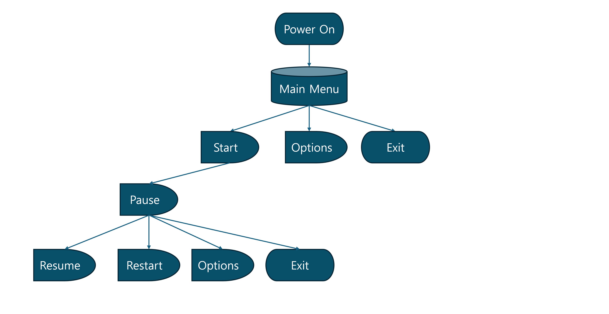

# Tetris

## Index

- [개요](#개요)
- [시현 영상](#시현-영상)
- [요구 사항 분석](#요구-사항-분석)
  - [1. 도입](#1-도입)
    - [1.1. 기본 용어](#11-기본-용어)
  - [2. 기본 게임 흐름](#2-기본-게임-흐름)
    - [2.1 인터페이스](#21-인터페이스)
  - [3. 테트로미노 생성](#3-테트로미노-생성)
    - [3.1 무작위 생성](#31-무작위-생성)
  - [4. 컨트롤](#4-컨트롤)
  - [5. 테트로미노 조작](#5-테트로미노-조작)
    - [5.1 이동(Movement)](#51-이동movement)
    - [5.2 자동 반복(Auto-Repeat)](#52-자동-반복auto-repeat)
    - [5.3 회전(Rotation)](#53-회전rotation)
    - [5.4 하드 드롭(Hard Drop)](#54-하드-드롭hard-drop)
    - [5.5 소프트 드롭(Soft Drop)](#55-소프트-드롭soft-drop)
    - [5.6 홀드(Hold)](#56-홀드hold)
    - [5.7 연장 배치 잠금(Extended Placement Lock Down)](#57-연장-배치-잠금extended-placement-lock-down)
  - [6. 레벨 및 목표](#6-레벨-및-목표)
- [설계](#설계)
  - [프로그램 흐름](#프로그램-흐름)
  - [클래스 디자인](#클래스-디자인)
    - [UserWidget](#userwidget)
    - [Actor and ActorComponent](#actor-and-actorcomponent)
    - [GameMode and PlayerState](#gamemode-and-playerstate)
    - [PlayerController](#playercontroller)
    - [UObject and UInterface](#uobject-and-uinterface)
    - [Etc](#etc)
- [구현](#구현)
  - [UI](#ui)
    - [UTetrisWidgetMenuBase](#utetriswidgetmenubase)
    - [UTetrisWidgetMenuMain](#utetriswidgetmenumain)
  - [주요 클래스](#주요-클래스)
  - [오디오](#오디오)

---

## 개요

언리얼 엔진으로 테트리스를 만드는 프로젝트

- 개발 기간: 2024.05.28 ~ (진행 중)
- 개발 환경:
  - 1인 개발
  - OS: Windows 11
  - Engine: Unreal Engine 5.1.1
  - IDE: Visual Studio 2022
  - AI coding assistant: GitHub Copilot
  - Source Control: Git, GitHub

### 프로젝트 진행 방식

[2009 Tetris Design Guideline](./Documents/2009_Tetris_Design_Guideline.pdf)을 준수하되,  
처음부터 모든 걸 설계한 후에 구현하지 않고 하나씩 기능을 추가하면서 점진적으로 개발.

개인 프로젝트이지만 단위 기능 구현마다 [Pull Request](https://github.com/keunbum/Tetris/pulls?q=is%3Apr+is%3Aclosed)를 통해 진행 상황을 정리하고 간단한 코드 리뷰 진행.

### Best Practice

- [TETRIS 99](https://namu.wiki/w/TETRIS%2099)
- [Tetris Effect](https://namu.wiki/w/Tetris%20Effect)

### Coding Standard
[Unreal Engine Coding Standard](https://dev.epicgames.com/documentation/en-us/unreal-engine/epic-cplusplus-coding-standard-for-unreal-engine) 준수.

---

## 시현 영상

- (유튜브 링크 첨부 예정)

---

## 요구 사항 분석

[2009 Tetris Design Guideline](./Documents/2009_Tetris_Design_Guideline.pdf)의 일부를 수정 및 요약하였다.

### 1. 도입
#### 1.1. 기본 용어

**Line Clear**  
가로 행이 블록으로 완전히 채워지면 매트릭스에서 제거되는 상태. 클리어된 라인 위의 모든 조각(piece)은 아래로 이동하여 공간을 채운다.  

**Lock Down**  
플레이 중인(매트릭스에 나와 있는) 테트로미노가 잠겨 플레이어가 이를 더 이상 조작할 수 없는 지점.  
일반적으로 테트로미노가 지면(매트릭스의 바닥이나 기존 블록)에 착지하고 나서 0.5초 후에 발생한다.  

**Matrix**  
활성 게임 영역을 만드는 직사각형 셀 배열로, 일반적으로 너비 10열 x 20행이다.  

**Mino**  
테트로미노를 이루는 단일 정사각형 모양의 구성 요소.  

**Skyline**  
매트릭스 상단의 수평선. 테트로미노는 스카이 라인 바로 위에서 떨어지기 시작한다.

**Tetromino(테트로미노)**  
측면을 따라 연결된 4개의 미노들로 구성된 기하학적 Tetris® 모양.  
각각 고유한 색상으로 표시되는 4개의 미노들을 사용하여 총 7개의 테트로미노를 만들 수 있다.  


### 2. 기본 게임 흐름

#### 2.1 인터페이스


**1. The Matrix**  
게임 플레이가 발생하는 영역이다. 표준 매트릭스 치수는 높이 20셀 x 너비 10셀이다.

**2. Tetromino in Play**  
매트릭스에 들어와 있는 테트로미노.  
플레이어는 이 테트로미노를 오른쪽 또는 왼쪽으로 이동하고, 시계 방향 또는 반시계 방향으로 회전하고, 하드 또는 소프트 드롭으로 조작할 수 있다.  
하드 드롭을 하면 테트로미노가 즉시 똑바로 떨어져서 착지한 첫 번째 표면에 고정된다(잠긴다).  
소프트 드롭은 버튼을 놓을 때까지 현재 낙하 속도보다 20배 빠르게 테트로미노를 떨어뜨린다.

**3. Next Queue**  
넥스트 큐를 통해 플레이어는 생성되어 플레이에 투입될 다음 테트로미노를 볼 수 있다.

**4. Ghost Piece**  
**Tetromino in Play**의 복사본이며 플레이어에게 플레이 테트로미노가 현재 위치에서 "떨어지면" 멈출 위치를 알려준다. 고스트 피스는 테트로미노 윤곽선 또는 테트로미노의 반투명한 "유령" 이미지로 나타날 수 있다.

**5. Game Information**  
플레이 중인 게임과 관련된 정보가 화면에 표시된다.

- 경과시간
- 현재 레벨
- 지워진 줄 수 / 지워야 할 남은 줄 수

**6. Hold Queue**  
홀드 큐를 통해 플레이어는 떨어지는 테트리미노를 고정(홀드)할 수 있다.
홀드 큐에 이미 있는 테트리미노가 있는 경우 꺼내온다.

### 3. 테트로미노 생성

#### 3.1 무작위 생성

Tetris는 일명 **bag** 시스템([7-bag system](https://namu.wiki/w/%ED%85%8C%ED%8A%B8%EB%A6%AC%EC%8A%A4/%EC%9A%A9%EC%96%B4#s-5.3))을 사용하여 게임 플레이 중에 나타나는 테트로미노의 순서를 결정한다.  
이 시스템은 7개의 테트로미노 간 균등한 분배를 허용한다.

7개의 서로 다른 테트로미노를 가상의 가방(bag)에 넣은 후 무작위 순서로 섞는다. 이 순서는 곧 bag이 [Next Queue](#3-next-queue)에  
공급하는 순서를 의미한다. 새로운 테트로미노가 생성되어 매트릭스 내에서 떨어지기 시작할 때마다 가방의 라인 맨  
앞에 있는 테트로미노는 Next Queue의 끝에 배치되어 모든 테트로미노를 하나씩 앞으로 밀어낸다.  
가방이 비워지면 다시 채워지고 섞인다.


### 4. 컨트롤

|          Control Function         |           Joystick          |   Keyboard  |
|:---------------------------------:|:---------------------------:|:-----------:|
|        Move Tetromino LEFT        |     Directional Pad LEFT    |  LEFT Arrow |
|        Move Tetromino RIGHT       |    Directional Pad RIGHT    | Right Arrow |
|             Hard Drop             |      Directional Pad UP     |  Space Bar  |
|             Soft Drop             |     Directional Pad DOWN    |  DOWN Arrow |
|    Rotate Tetromino Clockwise     |     Outer (Right) Button    | UP Arrow, X |
| Rotate Tetromino Counterclockwise |     Inner (Left) Button     |      Z      |
|                Hold               | Button3 /  Shoulder Buttons |      C      |
|             Pause Game            |        Start / Select       |    Esc      |


### 5. 테트로미노 조작

### 5.1 이동(Movement)

테트로미노(Tetromino in play)는 한 번에 한 셀씩 스카이라인 바로 위에서 떨어지고 한 번에 한 셀씩 왼쪽과 오른쪽으로 이동한다. 오른쪽, 왼쪽 및 아래쪽 이동만 허용된다.

### 5.2 자동 반복(Auto-Repeat)

이동 버튼을 탭하면 누른 방향으로 테트로미노의 단일 셀 이동을 할 수 있다. 이동 버튼을 누르고 있으면
플레이어가 테트로미노를 매트릭스의 한 쪽에서 다른 쪽으로 약 0.5초 안에 이동할 수 있는 **자동 반복** 동작이 트리거된다. 

이동 버튼을 누르는 시간과 자동 반복이 시작되는 시간 사이에 약 0.3초 정도의 지연(**자동 반복 지연 시간**)이 있어야 한다. 
이러한 **자동 반복 지연**은 테트로미노의 원치 않는 추가 움직임을 방지한다. 자동 반복은 왼쪽/오른쪽 이동에만 영향을 미친다.
자동 반복은 이동 버튼을 누르고 있는 동안 다음 테트로미노가 나오기 전(현재 테트로미노 [잠금](#lock-down) 후)까지 계속된다.

또한 자동 반복이 시작되고 플레이어가 반대 방향 버튼을 누르고 있으면 테트로미노는 초기 지연과 함께 
반대 방향으로 이동을 시작해야 한다. 이것은 주로 둘 이상의 방향 버튼을 동시에 누를 수 있는 키보드나 휴대폰과 같은 이동 버튼이 있는 장치에 적용된다.
그런 다음 버튼 하나를 놓으면 테트로미노는 약 0.3초의 자동 반복 지연이 한 번 더 적용된 상태에서 여전히 잡고 있는 방향으로 다시 이동해야 한다.

### 5.3 회전(Rotation)

테트로미노는 **슈퍼 회전 시스템**(Super Rotation System)을 사용하여 시계 방향 및 시계 반대 방향으로 회전할 수 있다. 이 시스템은 벽에 대고 회전하는 것과 같이 원래의 클래식 회전 시스템이 허용하지 않는 상황에서 테트로미노 회전을 허용한다.

회전 버튼을 누를 때마다 플레이 테트로미노가 시계 방향 또는 반시계 방향으로 90도 회전한다. 테트로미노가 왼쪽 또는 오른쪽으로 자동 반복되는 동안 회전을 수행할 수 있다. 회전 자체에 자동 반복은 없다.

### 5.4 하드 드롭(Hard Drop)

하드 드롭 명령은 테트로미노를 즉시 떨어뜨리고 바로 아래 표면에 고정시킨다. 하드 드롭된 테트로미노가 현재 위치에서 [잠기기](#lock-down)까지 떨어지는 데 걸리는 시간은 0.0001초이다. 하드 드롭에는 자동 반복이 없다.

### 5.5 소프트 드롭(Soft Drop)

소프트 드롭 명령을 누르면 플레이 중인 테트로미노가 일반 낙하 속도보다 20배 빠른 속도(라인당 초 단위로 측정됨. 즉, 한 줄 이동하는데 몇 초 걸리는지)로 떨어진다. 소프트 드롭 버튼에서 손을 떼면 테트로미노가 정상 낙하 속도를 재개한다. 예를 들어 정상적인 낙하 속도가 라인당 0.5초이면 소프트 드롭 속도는 라인당 (0.5 / 20) = 0.025초이다.

플레이어가 테트로미노를 표면에 떨어질 때까지 소프트 드롭하면 잠금 타이머가 0이 되기 전에는 [잠금](#lock-down)이 발생하지 않는다. 

아래로 이동을 계속하려면 소프트 드롭 버튼을 길게 누른다. 소프트 드롭은 버튼을 누르고 있는 동안 다음 테트로미노가 나올 때까지 계속된다.

### 5.6 홀드(Hold)

Hold 명령을 사용하면 플레이 중인 테트로미노가 [홀드 큐](#8-hold-queue)에 배치된다. 이전에 가지고 있던 테트로미노는 생성 위치(스카이 라인 바로 위)와 북쪽을 향하는 방향에서 시작하여 매트릭스 상단에서 떨어지기 시작한다. 하나의 테트로미노만 홀드할 수 있다.

잠금은 반드시 보류와 보류 사이에 발생해야 한다. 예를 들어 처음에는 첫 번째 테트로미노가 생성되고 떨어지기 시작한다. 플레이어는 이 테트로미노를 홀드하기로 결정한다. 그러면 즉시 Next Queue에서 다음 테트로미노가 생성되고 떨어지기 시작한다. 플레이어는 다른 테트로미노를 홀드하고 싶다면 먼저 이 테트로미노(플레이 테트로미노)를 잠가야 한다. 즉, 동일한 테트로미노를 두 번 이상 홀드 할 수 없다.

### 5.7 연장 배치 잠금(Extended Placement Lock Down)

옵션 메뉴의 기본 잠금 설정이다.  
Tetris의 멀티플레이어 아케이드 변형은 이 유형의 잠금을 사용해야 한다.

플레이 테트리미노가 매트릭스의 표면에 착지하면 잠금 타이머가 0.5초부터 카운트다운을 시작한다. 0에 도달하면 테트로미노가 잠기고 다음 테트로미노의 생성 단계가 시작된다. 잠금 타이머는 플레이어가 테트리미노를 단순히 움직이거나 회전시키면 0.5초로 재설정된다. 연장 배치에서 테트로미노는 잠금 타이머에 남은 시간에 관계없이 잠금 전에 왼쪽/오른쪽으로 15번 이동하거나 회전한다. 그러나 테트로미노가 도달한 가장 낮은 행보다 한 행 아래로 떨어지면 이 카운터가 재설정된다. 다른 모든 경우에는 재설정되지 않는다.

참고: 테트로미노가 가장 낮은 선으로 떨어진 다음 이 선 위로 올라가면 15번의 이동/회전을 계속 사용한다. 이러한 움직임/회전이 사용되면 잠금 타이머가 재설정되지 않고 테트로미노가 접촉하는 첫 번째 표면에서 즉시 잠금된다. 표면에 닿지 않으면 더 이동/회전될 수 있다. 이전 최저선 아래의 선으로 떨어지면 다시 총 15회의 이동/회전을 받게 된다.

### 6. 레벨 및 목표
일반적인 Tetris 변형은 15단계 플레이(1에서 15까지)를 특징으로 한다.  
레벨 업은 플레이어가 레벨당 필요한 라인 수를 지우거나 목표를 클리어할 때 발생한다.

레벨이 올라감에 따라 낙하 속도가 증가하고 라인 클리어 및 T-스핀과 같은 작업에 대해 더 많은 포인트가 부여된다.

변형/플랫폼에 가장 적합한 목표 시스템 유형을 선택하는 것이 좋다. 이 지침에는 두 가지가 나열되어 있다. 
고정 목표 시스템은 레벨 15까지 각 레벨마다 10줄이 필요하고 가변 목표 시스템은 플레이어가 레벨 1에서 
5줄, 레벨 2에서 10줄, 레벨 3에서 15줄을 클리어하는 식으로 레벨 15까지 각 레벨에서 5줄을 추가해야 한다.

따라서 고정 목표 시스템에서는 레벨 15까지 150줄을 클리어해야 하는 반면, 가변 목표 시스템에서는 레벨 15까지 5줄씩 추가하면서 총 600줄을 클리어해야 한다.

---

## 설계

### 프로그램 흐름



### 클래스 디자인

- #### UserWidget


- #### Actor and ActorComponent


- #### GameMode and PlayerState


- #### PlayerController


- #### UObject and UInterface


- ### Etc


---

## 구현

로직은 대부분 블루프린트 대신 C++로 작성하였다.

### UI

UUserWidget을 상속 받은 C++ 클래스 작성 후, 이를 상속 받은 위젯 블루프린트 구현.  
분량이 많아 일부 클래스만 첨부.  

#### UTetrisWidgetMenuBase ([header](./Source/Tetris/Public/TetrisWidgetMenuBase.h) / [source](./Source/Tetris/Private/TetrisWidgetMenuBase.cpp))  
키보드로 메뉴 이동 시 버튼 포커싱을 처리하는 로직.

```cpp
FReply UTetrisWidgetMenuBase::NativeOnPreviewKeyDown(const FGeometry& InGeometry, const FKeyEvent& InKeyEvent)
{
	// 포커싱된 버튼이 없다면 첫 번째(디폴트) 버튼에 포커싱.
	if (IsNoButtonFocused())
	{
		SetDefaultMenuButtonFocus();
		return FReply::Handled();
	}

	// 버튼에 포커싱된 적 있지만, 다른 위젯에 포커싱 되었다가 돌아와 버튼 포커싱이 풀린 경우, 다시 맞춤.
	checkf(FMath::IsWithin(FocusedButtonIndex, 0, MenuButtons.Num()), TEXT("Invalid FocusedButtonIndex: %d"), FocusedButtonIndex);
	if (UMenuButton* const MenuButton = MenuButtons[FocusedButtonIndex];
		MenuButton && !MenuButton->HasKeyboardFocus())
	{
		MenuButton->SetKeyboardFocus();
		return FReply::Handled();
	}

	// 버튼 포커싱 되어 있다면 사용자 입력에 따라 버튼 이동.
	const FKey Key = InKeyEvent.GetKey();
	if (EMenuMoveDirection MenuMoveDirection = EMenuMoveDirection::None;
		UTetrisWidgetMenuBase::GetMenuMoveDirection(Key, MenuMoveDirection))
	{
		const int32 MoveDelta = UTetrisWidgetMenuBase::GetMenuMoveDelta(MenuMoveDirection);
		MoveMenuButtonFocus(MoveDelta);
		return FReply::Handled();
	}

	return Super::NativeOnPreviewKeyDown(InGeometry, InKeyEvent);
}

void UTetrisWidgetMenuBase::MoveMenuButtonFocus(const int32 MoveDelta)
{
	// 끝단 버튼에서 이동하면 반대쪽 끝단 버튼으로 이동.
	// 연결 리스트로 구현할 수도 있지만 편의상 배열로 구현.
	const int32 NewFocusedButtonIndex = (FocusedButtonIndex + MoveDelta + MenuButtons.Num()) % MenuButtons.Num();
	SetMenuButtonFocusByButtonIndex(NewFocusedButtonIndex);
}

```

#### UTetrisWidgetMenuMain
메인 메뉴용 위젯 블루프린트인 [WB_MenuMain](./Content/UI/WB_MenuMain.uasset)가 상속 받는 클래스.  
버튼 포커싱 처리를 위해 배열(MenuButtons)로 버튼 관리.

##### TetrisWidgetMenuMain.h
```cpp
#include "CoreMinimal.h"
#include "TetrisWidgetMenuBase.h"
#include "TetrisWidgetMenuMain.generated.h"

class UTetrisWidgetPopupOption;

/**
 * 
 */
UCLASS()
class TETRIS_API UTetrisWidgetMenuMain : public UTetrisWidgetMenuBase
{
	GENERATED_BODY()

protected:
	/** UUserWidget Interface */
	virtual void NativeOnInitialized() override;
	/** ~UUserWidget Interface */

private:
	UFUNCTION()
	void OnStartClicked();

	UFUNCTION()
	void OnOptionClicked();

	UFUNCTION()
	void OnExitClicked();

private:
	UPROPERTY(meta = (BindWidget))
	TObjectPtr<UMenuButton> StartButton;

	UPROPERTY(meta = (BindWidget))
	TObjectPtr<UMenuButton> OptionButton;

	UPROPERTY(meta = (BindWidget))
	TObjectPtr<UMenuButton> ExitButton;

	/** Widget References */
	UPROPERTY()
	TObjectPtr<UTetrisWidgetPopupOption> WidgetPopupOption;

	/** Widget Class References */
	UPROPERTY(EditDefaultsOnly, Category = "Classes")
	TSubclassOf<UTetrisWidgetPopupOption> WidgetPopupOptionClass;
};
```

##### TetrisWidgetMenuMain.cpp
```cpp

#include "TetrisWidgetMenuMain.h"

#include "Kismet/GameplayStatics.h"

#include "TetrisGameModeIngame.h"
#include "TetrisWidgetPopupOption.h"
#include "MenuButton.h"

void UTetrisWidgetMenuMain::NativeOnInitialized()
{
	Super::NativeOnInitialized();

	if (StartButton)
	{
		MenuButtons.Add(StartButton);
		StartButton->OnClicked.AddDynamic(this, &UTetrisWidgetMenuMain::OnStartClicked);
	}
	if (OptionButton)
	{
		MenuButtons.Add(OptionButton);
		OptionButton->OnClicked.AddDynamic(this, &UTetrisWidgetMenuMain::OnOptionClicked);
	}
	if (ExitButton)
	{
		MenuButtons.Add(ExitButton);
		ExitButton->OnClicked.AddDynamic(this, &UTetrisWidgetMenuMain::OnExitClicked);
	}

	if (WidgetPopupOptionClass)
	{
		WidgetPopupOption = CreateWidget<UTetrisWidgetPopupOption>(GetWorld(), WidgetPopupOptionClass);
	}
}

void UTetrisWidgetMenuMain::OnStartClicked()
{
	// Open Tetris Level
	UGameplayStatics::OpenLevel(GetWorld(), ATetrisGameModeIngame::TetrisLevelName);
}

void UTetrisWidgetMenuMain::OnOptionClicked()
{
	if (WidgetPopupOption)
	{
		WidgetPopupOption->AddToViewport();
	}
}

void UTetrisWidgetMenuMain::OnExitClicked()
{
	// Exit Game
	UKismetSystemLibrary::QuitGame(GetWorld(), nullptr, EQuitPreference::Quit, false);
}

```

#### WB_MenuMain


### 주요 클래스

### 오디오

---